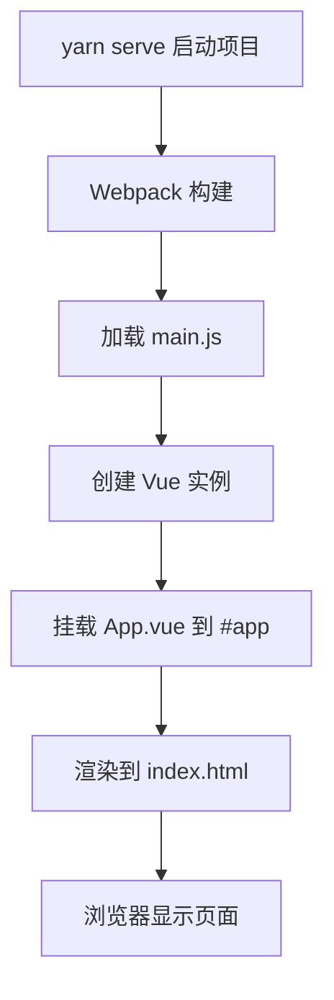

# Vue 2/3 

## Vue 基础概念

### 创建 Vue 实例

**概念**：Vue 实例是 Vue 应用的根实例，通过 new Vue()创建，它将数据和 DOM 进行绑定，实现响应式的数据驱动视图更新。

**创建步骤**：

1. 准备 HTML 容器
2. 引入 Vue.js 库
3. 创建 Vue 实例
4. 添加配置项完成渲染

**模板代码**：

```html
<!-- 1. 准备容器 -->
<div id="app">
  <!-- Vue管理的区域 -->
</div>

<!-- 2. 引入Vue库 -->
<script src="./vue.js"></script>
```

```javascript
// 3. 创建Vue实例
const app = new Vue({
  // 4. 配置选项
  el: "选择器", // 指定Vue管理的DOM元素
  data: {
    // 响应式数据
    属性名: 初始值,
  },
  methods: {
    // 方法定义
    方法名() {
      // 方法体
    },
  },
  computed: {
    // 计算属性
    计算属性名() {
      return 计算结果;
    },
  },
  watch: {
    // 侦听器
    被侦听属性(newVal, oldVal) {
      // 处理逻辑
    },
  },
});
```

**基础示例**：

```javascript
// 创建Vue实例
const app = new Vue({
  // el: 配置选择器，指定Vue管理的是哪个盒子
  el: "#app",

  // data：提供数据
  data: {
    msg: "Hello, Vue!",
    num: 123456,
    isVisible: true,
  },

  // methods：定义方法
  methods: {
    handleClick() {
      this.isVisible = !this.isVisible;
    },
  },
});
```

### 响应式特征

Vue 的核心特性之一是响应式数据绑定：

- 数据改变，视图自动更新
- data 中的数据，最终会被添加到实例上
- 访问数据：`实例.属性`，如 `app.msg`
- 修改数据：`实例.属性 = '值'`，如 `app.msg = 'hello'`

## Vue 插值表达式

**概念**：插值表达式是 Vue 的核心模板语法，使用双大括号`{{ }}`将 Vue 实例中的数据渲染到 HTML 模板中，实现数据的动态显示。

**模板语法**：

```html
<!-- 基础语法 -->
{{ 数据属性 }}

<!-- 表达式计算 -->
{{ 数学表达式 }} {{ 字符串拼接 }} {{ 三元运算符 }} {{ 方法调用 }}

<!-- 对象属性访问 -->
{{ 对象.属性 }} {{ 数组[索引] }}
```

**使用规则**：

1. 使用的数据必须在 data 中声明
2. 支持 JavaScript 表达式，不支持语句（如 if、for、while 等）
3. 不能在 HTML 属性中使用（需要用 v-bind）
4. 每个插值表达式只能包含单个表达式

**基础示例**：

```html
<div id="app">
  <!-- 简单数据显示 -->
  <p>{{ nickname }}</p>

  <!-- 方法调用 -->
  <p>{{ nickname.toUpperCase() }}</p>

  <!-- 字符串拼接 -->
  <p>{{ nickname + ' how are you!' }}</p>

  <!-- 三元运算符 -->
  <p>{{ age >= 18 ? '成年' : '未成年' }}</p>

  <!-- 对象属性访问 -->
  <p>{{ friends.name + ' ' + friends.desc }}</p>

  <!-- 数学运算 -->
  <p>{{ price * quantity }}</p>

  <!-- 数组访问 -->
  <p>{{ list[0] }}</p>
</div>
```

```javascript
data: {
  nickname: 'Vue',
  age: 20,
  friends: {
    name: '小明',
    desc: '我的好朋友'
  },
  price: 10,
  quantity: 3,
  list: ['苹果', '香蕉', '橙子']
}
```

## Vue 指令

Vue 指令是带有`v-`前缀的特殊属性，不同属性对应不同的功能。

### v-html

动态设置元素的 innerHTML。

**语法**：`v-html="表达式"`

```html
<div v-html="msg"></div>
```

```javascript
data: {
  msg: `<a href="https://apple.com.cn/" target="_blank">苹果官网</a>`;
}
```

### v-show 和 v-if

都可以控制元素的显示隐藏。

**语法**：`v-show="表达式"`、`v-if="表达式"`

**差异**：

- `v-show`：通过控制 CSS 属性`display: none`来隐藏元素
- `v-if`：控制 DOM 元素的创建与否
- `v-show`适合频繁切换的场景，`v-if`适合条件不经常改变的场景

```html
<div v-show="flag" v-html="msg"></div>
<div v-if="flag" v-html="msg"></div>
```

### v-else 和 v-else-if

辅助`v-if`进行条件渲染。

**语法**：

- `v-if="表达式" + v-else`
- `v-if="表达式" + v-else-if="表达式" + v-else`

**注意**：`v-else`一定要配合`v-if`使用

```html
<p v-if="score >= 90">成绩评定A：奖励电脑一台</p>
<p v-else-if="score >= 70">成绩评定B：奖励周末郊游</p>
<p v-else-if="score >= 60">成绩评定C：奖励零食礼包</p>
<p v-else>成绩评定D：惩罚一周不能玩手机</p>
```

### v-on 事件监听

**概念**：v-on 指令用于监听 DOM 事件，当事件触发时执行相应的 JavaScript 代码或调用方法。

**模板语法**：

```html
<!-- 基础语法 -->
<button v-on:事件名="处理逻辑">按钮</button>

<!-- 简写语法 -->
<button @事件名="处理逻辑">按钮</button>

<!-- 内联语句 -->
<button @click="变量++">按钮</button>

<!-- 调用方法 -->
<button @click="方法名">按钮</button>

<!-- 调用方法并传参 -->
<button @click="方法名(参数)">按钮</button>
```

**语法 1 - 内联语句**：直接在模板中编写简单的 JavaScript 表达式

```html
<button v-on:click="count--">-</button>
<button @click="count++">+</button>
<button @click="flag = !flag">切换</button>
```

**语法 2 - 调用方法**：调用 methods 中定义的方法

```html
<button @click="fn">控制显隐</button>
```

```javascript
methods: {
  fn() {
    // methods函数内的this指向Vue实例
    this.flag = !this.flag
  }
}
```

**语法 3 - 调用传参**：在事件处理中传递参数

```html
<button @click="fn(5)">可乐5元</button>
<button @click="fn(10)">咖啡10元</button>
<button @click="handleDelete(item.id)">删除</button>
```

```javascript
methods: {
  fn(price) {
    this.money -= price;
  },
  handleDelete(id) {
    this.list = this.list.filter(item => item.id !== id);
  }
}
```

### v-bind 属性绑定

**概念**：v-bind 指令用于**动态**绑定 HTML 属性，可以将 Vue 实例的数据绑定到元素的属性上，实现**属性值的动态更新**。

**模板语法**：

```html
<!-- 基础语法 -->
<元素 v-bind:属性名="表达式"></元素>

<!-- 简写语法 -->
<元素 :属性名="表达式"></元素>

<!-- 常用属性绑定 -->

<a :href="链接变量">链接</a>
<div :id="id变量"></div>
<input :value="值变量">
<button :disabled="布尔变量">按钮</button>
```

**基础示例**：

```html


<a :href="link">{{ linkText }}</a>
<input :placeholder="placeholderText" />
```

```javascript
data: {
  url: 'https://example.com/image.jpg',
  msg: '这是一张图片',
  link: 'https://vue.js.org',
  linkText: 'Vue官网',
  placeholderText: '请输入内容'
}
```

### v-for 列表渲染

**概念**：v-for 指令用于基于数组、对象或数字进行循环渲染，可以将数据列表渲染为 DOM 元素列表。

**模板语法**：

```html
<!-- 遍历数组 -->
<li v-for="(item, index) in 数组" :key="唯一标识">{{ item }} - {{ index }}</li>

<!-- 遍历对象 -->
<li v-for="(value, key, index) in 对象" :key="key">
  {{ key }}: {{ value }} - {{ index }}
</li>

<!-- 遍历数字 -->
<li v-for="n in 数字" :key="n">{{ n }}</li>
```

**参数说明**：

- `item`：当前遍历的元素值
- `index`：当前遍历元素的索引（可选）
- `value`：对象的属性值
- `key`：对象的属性名
- `n`：数字遍历时的当前数字

**数组遍历示例**：

```html
<ul>
  <!-- 简单数组 -->
  <li v-for="(fruit, index) in fruits" :key="index">
    {{ index + 1 }}. {{ fruit }}
  </li>

  <!-- 对象数组 -->
  <li v-for="(item, index) in list" :key="item.id">
    {{ item.name }} - {{ item.price }}元
  </li>
</ul>
```

```javascript
data: {
  fruits: ['苹果', '香蕉', '橙子'],
  list: [
    { id: 1, name: '苹果', price: 5 },
    { id: 2, name: '香蕉', price: 3 },
    { id: 3, name: '橙子', price: 4 }
  ]
}
```

**v-for 中的 key 属性**：

**概念**：key 是 Vue 用于跟踪列表项变化的特殊属性，帮助 Vue 高效地更新虚拟 DOM。

**重要性**：

- 给元素添加唯一标识，便于 Vue 进行列表项的正确排序和复用
- 提高列表渲染性能，避免不必要的 DOM 操作
- 确保组件状态的正确维护

**使用规则**：

- key 的值只能是字符串或数字类型
- key 的值必须具有唯一性
- 推荐使用数据的 id 作为 key
- 不推荐使用 index 作为 key（会导致性能问题）

```html
<!-- 推荐：使用唯一id -->
<li v-for="item in list" :key="item.id">{{ item.name }}</li>

<!-- 不推荐：使用index -->
<li v-for="(item, index) in list" :key="index">{{ item.name }}</li>
```

### v-model 双向数据绑定

**概念**：v-model 是 Vue 提供的**双向数据绑定指令**，**专门用于表单元素**，实现数据与视图的同步更新。

**模板语法**：

```html
<!-- 基础语法 -->
<input v-model="变量名" />

<!-- 不同表单元素的使用 -->
<input type="text" v-model="文本变量" />
<input type="checkbox" v-model="布尔变量" />
<input type="radio" v-model="选择变量" />
<select v-model="选项变量">
  <textarea v-model="文本变量"></textarea>
</select>
```

**作用**：

- 数据变化，视图自动更新
- 视图变化，数据自动更新
- 可以快速获取或设置表单元素内容

**基础示例**：

```html
<form>
  用户：<input type="text" v-model="username" /> <br />
  密码：<input type="password" v-model="password" /> <br />
  <button @click="login">登录</button>
  <button @click="reset">重置</button>
</form>
```

```javascript
data: {
  username: '',
  password: ''
},
methods: {
  login() {
    console.log(this.username, this.password);
  },
  reset() {
    this.username = '';
    this.password = '';
  }
}
```

**应用于其他表单元素**：

```html
<!-- 复选框 -->
是否单身：<input type="checkbox" v-model="isSingle" />

<!-- 单选框 -->
性别:
<input type="radio" name="gender" value="1" v-model="gender" />男
<input type="radio" name="gender" value="0" v-model="gender" />女

<!-- 下拉选择 -->
所在城市:
<select v-model="cityID">
  <option value="101">北京</option>
  <option value="102">上海</option>
  <option value="103">成都</option>
</select>

<!-- 文本域 -->
自我描述：<textarea v-model="desc"></textarea>
```

```javascript
data: {
  isSingle: true,
  gender: '1',
  cityID: '102',
  desc: 'Hello'
}
```

### Vue 指令修饰符

**概念**：指令修饰符是 Vue 指令的扩展功能，用于增强指令的行为，通过在指令后添加`.修饰符`的方式使用。

#### 按键修饰符

**模板语法**：

```html
<!-- 监听特定按键事件 -->
<input @keyup.按键名="处理函数" />
<input @keydown.按键名="处理函数" />
```

**常用按键修饰符**：

- `.enter` - 回车键
- `.tab` - Tab 键
- `.delete` - 删除键
- `.esc` - Esc 键
- `.space` - 空格键
- `.up/.down/.left/.right` - 方向键

**示例**：

```html
<input @keyup.enter="fn" v-model="username" />
```

```javascript
methods: {
  fn() {
    console.log(this.username);
  }
}
```

#### 事件修饰符

**模板语法**：

```html
<!-- 阻止事件冒泡 -->
<button @click.stop="处理函数">按钮</button>

<!-- 阻止默认行为 -->
<a @click.prevent="处理函数">链接</a>

<!-- 链式调用 -->
<button @click.stop.prevent="处理函数">按钮</button>
```

**常用事件修饰符**：

- `.stop` - 阻止事件冒泡
- `.prevent` - 阻止默认行为
- `.capture` - 添加事件监听器时使用事件捕获模式
- `.self` - 只当在 event.target 是当前元素自身时触发处理函数
- `.once` - 事件只触发一次

#### v-model 修饰符

**模板语法**：

```html
<!-- 去除首尾空格 -->
<input v-model.trim="变量名" />

<!-- 转换为数字类型 -->
<input v-model.number="变量名" />

<!-- 懒更新（失去焦点时更新） -->
<input v-model.lazy="变量名" />
```

**示例**：

```html
姓名：<input v-model.trim="username" /> 年龄：<input v-model.number="age" />
```

### v-bind 样式控制

**概念**：v-bind 不仅可以绑定普通属性，还可以专门用于动态控制元素的 class 和 style，实现样式的动态切换。

#### 控制 class 类名

**模板语法**：

```html
<!-- 对象语法：根据布尔值控制类名 -->
<div :class="{ 类名1: 布尔值1, 类名2: 布尔值2 }"></div>

<!-- 数组语法：批量添加类名 -->
<div :class="['类名1', '类名2', 条件 ? '类名3' : '']"></div>

<!-- 混合使用 -->
<div :class="[基础类名, { 动态类名: 条件 }]"></div>
```

**对象语法示例**：

```html
<div :class="{ active: isActive, disabled: isDisabled }">内容</div>
```

```javascript
data: {
  isActive: true,
  isDisabled: false
}
// 渲染结果：<div class="active">内容</div>
```

**数组语法示例**：

```html
<div :class="['box', 'container', isActive ? 'active' : '']">内容</div>
```

#### 控制 style 样式

**模板语法**：

```html
<!-- 对象语法：动态设置内联样式 -->
<div :style="{ CSS属性名: '值', CSS属性名: 变量 }"></div>

<!-- 数组语法：应用多个样式对象 -->
<div :style="[样式对象1, 样式对象2]"></div>
```

**示例**：

```html
<div
  :style="{ width: '300px', height: '300px', backgroundColor: 'darkcyan' }"
></div>
<div :style="{ width: percent + '%' }">进度条</div>
```

```javascript
data: {
  percent: 50;
}
```

## Vue 实例配置项

### data 数据

**概念**：data 选项用于声明组件的响应式数据，Vue 会将 data 中的属性转换为响应式属性。

**模板语法**：

```javascript
data: {
  属性名: 初始值,
  对象属性: {},
  数组属性: []
}
```

**示例**：

```javascript
data: {
  msg: 'Hello Vue',
  count: 0,
  user: {
    name: '张三',
    age: 18
  },
  list: ['apple', 'banana', 'orange']
}
```

在后期的脚手架、组件化开发模式中，一个组件的`data`选项会被提取到组件的`data`函数中，返回一个对象。

**目的**：

- 组件化开发：每个组件有自己的`data`，互不干扰，维护独立的一份数据对象。
- 数据响应式：组件内的数据变化会自动触发视图更新。

e.g.

```javascript
data() {
  return {
    msg: 'Hello Vue',
    count: 0,
    user: {
      name: '张三',
      age: 18
    },
    list: ['apple', 'banana', 'orange']
  }
}
```

### methods 方法

**概念**：methods 选项用于定义组件的方法，方法内的`this`自动绑定到 Vue 实例。

**模板语法**：

```javascript
methods: {
  方法名(参数1, 参数2) {
    // 方法体
    // this指向Vue实例
    return 返回值; // 可选
  }
}
```

**示例**：

```javascript
methods: {
  handleClick() {
    // this指向Vue实例
    this.count++;
  },
  handleDelete(id) {
    this.list = this.list.filter(item => item.id !== id);
  },
  async fetchData() {
    const res = await axios.get('/api/data');
    this.data = res.data;
  }
}
```

### computed 计算属性

**概念**：computed 选项用于定义计算属性，基于现有数据计算出新的属性值。

**模板语法**：

```javascript
computed: {
  计算属性名() {
    return 基于data的计算结果;
  }
}
```

### watch 侦听器

**概念**：watch 选项用于侦听数据变化，当数据发生变化时执行相应的回调函数。

**模板语法**：

```javascript
watch: {
  被侦听的属性名(newVal, oldVal) {
    // 变化时的处理逻辑
  }
}
```

## 计算属性 computed

**概念**：计算属性是基于现有数据计算出来的新属性，具有缓存特性，只有当依赖的数据发生变化时才会重新计算。

**模板语法**：

```javascript
computed: {
  计算属性名() {
    // 基于现有数据的计算逻辑
    return 计算结果;
  }
}
```

**基础示例**：

```javascript
computed: {
  totalCount() {
    // 计算礼物总数
    return this.list.reduce((prev, curr) => prev + curr.num, 0);
  }
}
```

```html
<p>礼物总数：{{ totalCount }} 个</p>
```

### 计算属性 vs 方法

**计算属性特点**：

- 基于响应式依赖进行缓存
- 只有相关响应式依赖发生改变时才会重新求值
- 多次访问会立即返回之前的计算结果
- 作为属性使用：`{{ 计算属性名 }}`

**方法特点**：

- 每次调用都会重新执行
- 没有缓存机制
- 作为方法调用：`{{ 方法名() }}`

**对比示例**：

```javascript
// 计算属性 - 有缓存
computed: {
  totalCount() {
    console.log('计算属性执行'); // 只打印一次
    return this.list.reduce((sum, item) => sum + item.num, 0);
  }
},
// 方法 - 无缓存
methods: {
  totalCountFn() {
    console.log('方法执行'); // 每次调用都打印
    return this.list.reduce((acc, item) => acc + item.num, 0);
  }
}
```

### 计算属性完整写法

**模板语法**：

```javascript
computed: {
  计算属性名: {
    // 获取值时调用
    get() {
      return 计算结果;
    },
    // 设置值时调用
    set(newValue) {
      // 处理设置逻辑
    }
  }
}
```

**示例**：

```javascript
computed: {
  fullName: {
    get() {
      return this.firstName + this.lastName;
    },
    set(val) {
      this.firstName = val.slice(0, 1);
      this.lastName = val.slice(1);
    }
  }
}
```

## 侦听器 watch

**概念**：侦听器用于观察和响应 Vue 实例上数据的变化，当被侦听的数据发生变化时，会执行相应的回调函数。

### 简单写法

**模板语法**：

```javascript
watch: {
  // 侦听根级别属性
  属性名(newVal, oldVal) {
    // 处理逻辑
  },
  // 侦听对象中的属性（需要加引号）
  'obj.属性名'(newVal, oldVal) {
    // 处理逻辑
  }
}
```

**示例**：

```javascript
watch: {
  'obj.words'(newVal) {
    // 防抖处理
    if (this.timer) clearTimeout(this.timer);
    this.timer = setTimeout(async () => {
      const res = await axios({
        url: 'https://api.example.com/translate',
        params: { words: newVal }
      });
      this.result = res.data.data;
    }, 300);
  }
}
```

### 完整写法

**模板语法**：

```javascript
watch: {
  属性名: {
    deep: true,      // 深度监听
    immediate: true, // 立即执行
    handler(newVal, oldVal) {
      // 处理逻辑
    }
  }
}
```

**配置选项**：

- `deep: true` - 深度监听，监听对象内部值的变化
- `immediate: true` - 立即执行一次 handler
- `handler` - 具体的处理函数

**示例**：

```javascript
watch: {
  obj: {
    deep: true,
    immediate: true,
    handler(newVal) {
      // 只要obj中任意属性发生变化都会触发
      localStorage.setItem('data', JSON.stringify(newVal));
    }
  }
}
```


## Vue 实例生命周期

### 四个阶段

**概念**：Vue 实例从创建到销毁的过程，每个阶段都有特定的钩子函数可以调用。Vue 生命周期是指 Vue 实例从创建到销毁的整个过程，在这个过程中会自动执行一些函数，这些函数被称为生命周期钩子函数。

**生命周期四个阶段**：① 创建 ② 挂载 ③ 更新 ④ 销毁

1. **创建阶段**：创建响应式数据
2. **挂载阶段**：渲染模板
3. **更新阶段**：修改数据，更新视图
4. **销毁阶段**：销毁 Vue 实例

### 生命周期钩子（hook）

Vue 生命周期过程中，会**自动运行一些函数**，被称为【**生命周期钩子**】→ 让开发者可以在【**特定阶段**】运行**自己的代码**


**八大生命周期钩子**：

**1. 创建阶段**：

- `beforeCreate`：实例初始化后，数据观测和事件配置之前调用，此时 data 和 methods 都不可用
- `created`：实例创建完成，数据观测和事件配置完成，但 DOM 未挂载，**常用于发送初始化请求**

**2. 挂载阶段**：

- `beforeMount`：挂载开始前调用，模板编译完成但未挂载到页面
- `mounted`：实例挂载完成，DOM 已挂载，**常用于 DOM 操作**

**3. 更新阶段**：

- `beforeUpdate`：数据更新时调用，发生在虚拟 DOM 打补丁之前
- `updated`：数据更新后调用，发生在虚拟 DOM 打补丁之后

**4. 销毁阶段**：

- `beforeDestroy`：实例销毁前调用，实例仍然完全可用
- `destroyed`：实例销毁后调用，所有事件监听器被移除

**模板代码**：

```javascript
const app = new Vue({
  el: "#app",
  data: {
    count: 100,
    title: "计数器",
  },

  // 八大钩子函数
  // 1. 创建阶段
  beforeCreate() {
    console.log("beforeCreate 响应式数据未准备", this.count);
    // this.count 输出 undefined
  },

  created() {
    console.log("created 数据准备完毕", this.count);
    // 常用于：发送初始化请求，获取数据
  },

  // 2. 挂载阶段
  beforeMount() {
    console.log(
      "beforeMount DOM未被渲染",
      document.querySelector("span").innerHTML
    );
    // 输出 {{ count }}
  },

  mounted() {
    console.log("mounted DOM已渲染", document.querySelector("span").innerHTML);
    // 常用于：DOM操作，如获取焦点、初始化图表等
  },

  // 3. 更新阶段
  beforeUpdate() {
    // 需要有数据更新，才会触发更新阶段
    console.log(
      "beforeUpdate 数据更新了，DOM未更新",
      document.querySelector("span").innerHTML
    );
  },
  updated() {
    console.log(
      "updated 数据更新了，DOM也更新了",
      document.querySelector("span").innerHTML
    );
  },

  // 4. 销毁阶段
  // 在控制台中，使用 app.$destroy() 销毁组件
  beforeDestroy() {
    console.log("beforeDestroy 组件销毁前");
  },
  destroyed() {
    console.log("destroyed 组件销毁后, 此时点击dom元素不再有响应");
  },
});
```

### created 应用场景

**概念**：created 钩子在 Vue 实例创建完成后立即调用，此时数据观测和事件配置已完成，但 DOM 还未挂载。

**适用场景**：

- 发送初始化请求获取数据
- 进行数据的初始化处理
- 启动定时器
- 订阅消息

**模板代码**：

```javascript
async created() {
  // 发送请求获取数据
  const res = await axios.get('接口地址');
  this.数据属性 = res.data.data;
}
```

**实际应用 - 新闻列表**：

```javascript
const app = new Vue({
  el: "#app",
  data: {
    newsList: [],
  },
  async created() {
    // 页面加载完成后立即获取新闻数据
    const res = await axios.get("http://hmajax.itheima.net/api/news");
    this.newsList = res.data.data;
  },
});
```

```html
<ul>
  <li class="news" v-for="(item, index) in newsList" :key="item.id">
    <div class="left">
      <div class="title">{{ item.title }}</div>
      <div class="info">
        <span>{{ item.source }}</span>
        <span>{{ item.time }}</span>
      </div>
    </div>
    <div class="right">
      
    </div>
  </li>
</ul>
```

### mounted 应用场景

**概念**：mounted 钩子在 Vue 实例挂载完成后调用，此时 DOM 已经渲染完成，可以进行 DOM 操作。

**适用场景**：

- DOM 操作（获取焦点、获取元素尺寸等）
- 初始化第三方库（如图表库、地图等）
- 启动轮播图等需要 DOM 的功能

**模板代码**：

```javascript
mounted() {
  // DOM操作
  document.querySelector('#元素id').focus();

  // 初始化第三方库
  this.chart = echarts.init(document.querySelector('#chart'));
}
```

**实际应用 - 输入框获取焦点**：

```javascript
const app = new Vue({
  el: "#app",
  data: {
    words: "",
  },
  mounted() {
    // 等待输入框渲染完毕后获取焦点
    document.querySelector("#inp").focus();
  },
});
```

```html
<div class="search-box">
  <input type="text" v-model="words" id="inp" />
  <button>搜索一下</button>
</div>
```

**实际应用 - 初始化图表**：

```javascript
const app = new Vue({
  el: "#app",
  data: {
    list: [],
  },
  mounted() {
    // echarts 使用 → 3步走（前提：已经引入了 echarts 库）

    //  1. 初始化echarts图表
    // 声明变量时，由于需要在外部函数中使用 setOption 函数以动态更新图表，所以提升变量，将 myChart 挂载到 Vue 实例上
    this.myChart = echarts.init(document.querySelector("#main"));

    // 2. 配置图表选项
    this.option = {
      title: {
        text: "消费账单占比",
        left: "center",
      },
      tooltip: {
        trigger: "item",
      },
      series: [
        {
          name: "消费账单",
          type: "pie",
          radius: "50%",
          data: [],
        },
      ],
    };

    // 3. 使用配置项显示图表
    // 注意统一使用 this，因为该变量统一挂载到了实例上；没有 this 则会出现未定义报错
    this.myChart.setOption(this.option);
  },
});
```

### 生命周期综合案例 - 小黑记账清单

**功能需求**：

1. 页面加载时获取账单数据（created）
2. DOM 渲染完成后初始化图表（mounted）
3. 添加、删除账单功能
4. 实时更新饼图显示

**完整实现**：

```javascript
const app = new Vue({
  el: "#app",
  data: {
    list: [],
    name: "",
    price: "",
  },

  computed: {
    totalPrice() {
      return this.list.reduce((prev, curr) => prev + curr.price, 0);
    },
  },

  // 1. 页面加载时获取数据
  created() {
    this.renderer();
  },

  // 2. DOM渲染完成后初始化图表
  mounted() {
    // 初始化echarts实例
    this.myChart = echarts.init(document.querySelector("#main"));

    // 配置图表选项
    this.option = {
      title: {
        text: "消费账单占比",
        left: "center",
      },
      tooltip: {
        trigger: "item",
      },
      legend: {
        orient: "vertical",
        left: "left",
      },
      series: [
        {
          name: "消费账单",
          type: "pie",
          radius: "50%",
          data: [],
          emphasis: {
            itemStyle: {
              shadowBlur: 10,
              shadowOffsetX: 0,
              shadowColor: "rgba(0, 0, 0, 0.5)",
            },
          },
        },
      ],
    };

    this.myChart.setOption(this.option);
  },

  methods: {
    // 渲染数据和图表
    async renderer() {
      const res = await axios.get(
        "https://applet-base-api-t.itheima.net/bill",
        {
          // get 方法需要单独的 params 对象
          params: {
            creator: "StelleRainn",
          },
        }
      );
      this.list = res.data.data;

      // 更新图表数据
      if (this.myChart) {
        this.myChart.setOption({
          // 需要修改什么，就修改什么
          series: [
            {
              // 注意加上括号以避免对象被识别为函数体或代码段
              data: this.list.map((curr) => ({
                value: curr.price,
                name: curr.name,
              })),
            },
          ],
        });
      }
    },

    // 添加账单
    async addItem() {
      // 校验表单数据
      if (!this.name.trim() || !this.price) {
        alert("请填写完整信息");
        return;
      }

      await axios.post("https://applet-base-api-t.itheima.net/bill", {
        creator: "StelleRainn",
        name: this.name,
        price: this.price,
      });

      // 重新渲染
      this.renderer();

      // 清空表单
      this.name = "";
      this.price = "";
    },

    // 删除账单
    async delItem(id) {
      await axios.delete("https://applet-base-api-t.itheima.net/bill/" + id);
      this.renderer();
    },
  },
});
```

```html
<div id="app">
  <div class="contain">
    <!-- 左侧列表 -->
    <div class="list-box">
      <!-- 添加表单 -->
      <form class="my-form">
        <input v-model="name" type="text" placeholder="消费名称" />
        <input v-model="price" type="text" placeholder="消费价格" />
        <button type="button" @click="addItem">添加账单</button>
      </form>

      <!-- 账单列表 -->
      <table class="table table-hover">
        <thead>
          <tr>
            <th>编号</th>
            <th>消费名称</th>
            <th>消费价格</th>
            <th>操作</th>
          </tr>
        </thead>
        <tbody>
          <tr v-for="(item, index) in list" :key="item.id">
            <td>{{ index + 1 }}</td>
            <td>{{ item.name }}</td>
            <td :class="{ red: item.price > 178 }">
              {{ item.price.toFixed(2) }}
            </td>
            <td><a href="javascript:;" @click="delItem(item.id)">删除</a></td>
          </tr>
        </tbody>
        <tfoot>
          <tr>
            <td colspan="4">消费总计： {{ totalPrice.toFixed(2) }}</td>
          </tr>
        </tfoot>
      </table>
    </div>

    <!-- 右侧图表 -->
    <div class="echarts-box" id="main"></div>
  </div>
</div>
```

## 工程化开发与脚手架

**开发 Vue 的两种方式**

- 核心包传统开发模式：基于 html / css / js 文件，直接引入核心包，开发 Vue。
- **工程化开发模式：基于构建工具（例如：webpack）的环境中开发 Vue。**

**工程化开发模式的优势**：

- 提供了项目的结构和组织方式，方便开发和维护。
- 集成了代码转换、压缩、热更新等功能，支持新语法（如 ES6+，LESS，Sass，TS 等）和新特性（如组件化），提高开发效率。
- 支持模块化开发，方便代码的拆分和复用。
- 提供了丰富的插件和工具，满足不同项目的需求。

### 脚手架 Vue CLI

**基本介绍**

Vue CLI 是 Vue 官方提供的一个**全局命令工具**

可以帮助我们**快速创建**一个开发 Vue 项目的**标准化基础架子**。【集成了 webpack 配置】

**好处**

1. 开箱即用，零配置
2. 内置 babel 等工具
3. 标准化的 webpack 配置

**使用步骤：**

1. **全局安装**（只需安装一次即可）

   ```bash
   # 使用 yarn
   yarn global add @vue/cli
   # 或使用 npm
   npm i @vue/cli -g
   ```

2. **查看版本**

   ```bash
   vue --version
   ```

3. **创建项目**

   ```bash
   vue create project-name
   ```

   > 注意：项目名不能使用中文，建议使用小写字母和连字符

4. **启动项目**

   ```bash
   # 进入项目目录
   cd project-name
   # 启动开发服务器
   yarn serve
   # 或
   npm run serve
   ```

   > 具体命令可在 package.json 的 scripts 字段中查看

5. **备注**

   `node_modules`一般不会被 git 所添加，在其他设备使用`git clone`同步后，需要运行`yarn install`来保证模块被安装。

**创建项目时的配置选项**

- **Default ([Vue 2] babel, eslint)**：默认配置，适合快速开始
- **Default ([Vue 3] babel, eslint)**：Vue 3 默认配置
- **Manually select features**：手动选择功能，可自定义配置
  - Babel：ES6+ 语法转换
  - TypeScript：TypeScript 支持
  - Progressive Web App (PWA) Support：PWA 支持
  - Router：Vue Router 路由
  - Vuex：状态管理
  - CSS Pre-processors：CSS 预处理器（Sass/Less/Stylus）
  - Linter / Formatter：代码检查和格式化
  - Unit Testing：单元测试
  - E2E Testing：端到端测试

### 项目结构与运行流程

#### 项目目录结构

```
project-name/
├── node_modules/           # 项目依赖的模块（自动生成，不需要手动修改）
├── public/                 # 静态资源目录（不会被webpack处理）
│   ├── index.html         # 项目的入口HTML模板文件
│   └── favicon.ico        # 网站图标
├── src/                   # 项目的源代码目录（开发的主要工作区域）
│   ├── assets/            # 静态资源目录（会被webpack处理）
│   │   ├── images/        # 图片资源
│   │   ├── styles/        # 样式文件
│   │   └── fonts/         # 字体文件
│   ├── components/        # 可复用组件目录
│   │   ├── BaseComponent.vue
│   │   └── CommonComponent.vue
│   ├── views/             # 页面级组件目录（路由组件）
│   │   ├── Home.vue
│   │   └── About.vue
│   ├── router/            # 路由配置目录
│   │   └── index.js
│   ├── store/             # 状态管理目录（Vuex）
│   │   └── index.js
│   ├── utils/             # 工具函数目录
│   │   └── request.js
│   ├── App.vue            # 项目的根组件
│   └── main.js            # 项目的入口JS文件
├── package.json           # 项目的依赖配置文件
├── package-lock.json      # 依赖版本锁定文件
├── README.md              # 项目的说明文档
├── .gitignore             # Git忽略文件配置
├── babel.config.js        # Babel配置文件
└── vue.config.js          # Vue CLI配置文件（可选）
```

#### 核心文件说明

- **src/main.js**：项目入口文件，负责创建 Vue 实例并挂载到 DOM
- **src/App.vue**：根组件，所有其他组件的父组件
- **public/index.html**：HTML 模板，Vue 应用最终会挂载到这里
- **package.json**：项目配置文件，包含依赖、脚本命令等信息

**重点文件详解**

1. **main.js** - 项目入口文件

   ```javascript
   import { createApp } from "vue";
   import App from "./App.vue";

   createApp(App).mount("#app");
   ```

2. **App.vue** - 根组件

   ```vue
   <template>
     <div id="app">
       <!-- 应用内容 -->
     </div>
   </template>

   <script>
   export default {
     name: "App",
   };
   </script>

   <style>
   /* 全局样式 */
   </style>
   ```

3. **index.html** - HTML 模板文件
   ```html
   <!DOCTYPE html>
   <html lang="">
     <head>
       <meta charset="utf-8" />
       <title>Vue App</title>
     </head>
     <body>
       <div id="app"></div>
       <!-- built files will be auto injected -->
     </body>
   </html>
   ```

#### 项目运行流程



**详细步骤：**

1. 执行 `yarn serve` 启动开发服务器
2. Webpack 开始构建项目，处理各种文件类型
3. 自动加载 `src/main.js` 入口文件
4. `main.js` 创建 Vue 应用实例并引入 `App.vue`
5. Vue 将 `App.vue` 组件渲染并挂载到 `public/index.html` 中的 `#app` 元素
6. 浏览器接收处理后的 HTML、CSS、JS 文件并显示页面
7. 开发服务器启动热重载，文件变化时自动刷新页面

## 组件化开发

**基本介绍**

组件化开发是指将一个复杂的应用拆分成多个组件，每个组件负责完成特定的功能，组件之间可以组合起来完成整个应用的功能。

**好处**

1. 代码复用：组件可以被多个地方使用，避免重复编写代码。
2. 维护方便：组件化开发使得代码结构清晰，维护方便。
3. 开发效率高：组件化开发使得开发效率高，开发周期短。

**组件化开发的实现方式**

1. 全局组件：在 main.js 文件中注册组件，全局可用。
2. 局部组件：在需要使用的组件中注册组件，只在当前组件可用。

**根组件 App.vue**

整个应用最上层的组件，包裹所有的小组件（类似树的根节点）

### 组件的三个组成部分

1. **`<template>`**：组件的模板，定义组件的结构和内容

   ```vue
   <template>
     <div class="my-component">
       <h1>{{ title }}</h1>
       <p>{{ content }}</p>
     </div>
   </template>
   ```

2. **`<script>`**：JavaScript 逻辑，定义组件的行为和逻辑

   ```vue
   <script>
   export default {
     name: "MyComponent",
     data() {
       return {
         title: "组件标题",
         content: "组件内容",
       };
     },
     methods: {
       handleClick() {
         console.log("按钮被点击");
       },
     },
   };
   </script>
   ```

3. **`<style>`**：组件的样式，定义组件的外观和布局
   ```vue
   <style scoped>
   .my-component {
     padding: 20px;
     border: 1px solid #ccc;
   }
   </style>
   ```

### 样式作用域和预处理器

- **scoped 属性**：使样式只作用于当前组件
  ```vue
  <style scoped>
  /* 样式只在当前组件生效 */
  </style>
  ```

**原理**：

- **scoped 属性**：通过在组件的样式标签上添加 `scoped` 属性，Vue 会为该组件的样式添加一个唯一的标识符（如 `data-v-hash值`），并将该标识符添加到组件的 DOM 元素上。
- **CSS 选择器**：在组件的样式中，所有的选择器都会被添加一个前缀，如 `.my-component[data-v-hash值]`，确保样式只作用于当前组件的 DOM 元素。

- **CSS 预处理器支持**：

  ```bash
  # 安装 Less
  yarn add less less-loader -D
  
  # 安装 Sass
  yarn add sass sass-loader -D
  ```

  ```vue
  <style lang="less" scoped>
  @primary-color: #007bff;
  
  .my-component {
    color: @primary-color;
  
    &:hover {
      opacity: 0.8;
    }
  }
  </style>
  ```

### 普通组件的注册使用-局部注册

顾名思义，只能在注册的组件内使用。

**步骤**：

1. 在 components 目录下创建组件文件（例如：MyComponent.vue）
2. 在需要使用的组件中引入组件文件
   ```javascript
   import MyComponent from "@/components/MyComponent.vue";
   ```
3. 在组件中注册组件
   ```javascript
   export default {
     components: {
      <!-- 同名变量简写 -->
       MyComponent
     }
   }
   ```
4. 在组件的模板中使用组件, 当成 html 标签使用即可
   ```html
   <MyComponent><MyComponent /></MyComponent>
   ```
   _p.s. 组件命名规范：大驼峰命名法_

### 普通组件的注册使用-全局注册

全局注册的组件，在项目的**任何组件**中都可以使用。

**步骤**：

1. 在 components 目录下创建组件文件（例如：GlobalComponent.vue）
2. 在**_main.js_**文件中引入组件文件
   ```javascript
   import GlobalComponent from "@/components/GlobalComponent.vue";
   ```
3. 在**_main.js_**文件中注册组件
   ```javascript
   Vue.component("GlobalComponent", GlobalComponent);
   ```
4. 在组件的模板中使用组件, 当成 html 标签使用即可
   ```html
   <GlobalComponent><GlobalComponent /></GlobalComponent>
   ```

_p.s. 通常在 IDE 内，可以先完成步骤 3，语法补全会自动引入步骤 2 中的代码_

### 组件开发最佳实践

**1. 组件命名规范**

- 使用 PascalCase（大驼峰）命名：`MyComponent.vue`
- 组件名应该具有描述性：`UserProfile.vue`、`ProductCard.vue`
- 避免与 HTML 标签冲突：不要使用 `Header.vue`，可以用 `AppHeader.vue`

**2. 组件文件组织**

```
src/
├── components/
│   ├── common/           # 通用组件
│   │   ├── BaseButton.vue
│   │   ├── BaseInput.vue
│   │   └── BaseModal.vue
│   ├── layout/           # 布局组件
│   │   ├── AppHeader.vue
│   │   ├── AppSidebar.vue
│   │   └── AppFooter.vue
│   └── business/         # 业务组件
│       ├── UserProfile.vue
│       └── ProductList.vue
```

### 组件化开发 综合案例 小兔鲜组件化

```html
<!-- App.vue -->
<template>
  <div id="app">
    <!-- 快捷链接 -->
    <XtxShortCut></XtxShortCut>
    <!-- 顶部导航 -->
    <XtxHeaderNav></XtxHeaderNav>
    <!-- 轮播区域 -->
    <XtxBanner></XtxBanner>
    <!-- 新鲜好物 -->
    <XtxNewGoods></XtxNewGoods>
    <!-- 热门品牌 -->
    <XtxHotBrand></XtxHotBrand>
    <!-- 最新专题 -->
    <XtxTopic></XtxTopic>
    <!-- 版权底部 -->
    <XtxFooter></XtxFooter>
  </div>
</template>

<script>
  // 引入组件
  import XtxShortCut from "./components/XtxShortCut";
  import XtxHeaderNav from "./components/XtxHeaderNav";
  import XtxBanner from "./components/XtxBanner";
  import XtxNewGoods from "./components/XtxNewGoods";
  import XtxHotBrand from "./components/XtxHotBrand";
  import XtxTopic from "./components/XtxTopic";
  import XtxFooter from "./components/XtxFooter";

  export default {
    // 注册为局部组件
    components: {
      XtxShortCut,
      XtxHeaderNav,
      XtxBanner,
      XtxNewGoods,
      XtxHotBrand,
      XtxTopic,
      XtxFooter,
    },
  };
</script>

<style></style>
```

举 XtxNewGoods 组件为例子

```html
<!-- XtxNewGoods.vue -->
<template>
  <!-- 新鲜好物 -->
  <div class="goods wrapper">
    <div class="title">
      <div class="left">
        <h3>新鲜好物</h3>
        <p>新鲜出炉 品质靠谱</p>
      </div>
      <div class="right">
        <a href="#" class="more"
          >查看全部<span class="iconfont icon-arrow-right-bold"></span
        ></a>
      </div>
    </div>
    <div class="bd">
      <ul>
        <BaseGoodsItem v-for="item in 4" :key="item"></BaseGoodsItem>
      </ul>
    </div>
  </div>
</template>

<script>
  export default {};
</script>

<style>
  /* 新鲜好物 */
  .goods .bd ul {
    display: flex;
    justify-content: space-between;
  }
</style>
```

这其中，又将`BaseGoodsItem` 抽离成子组件，且是全局组件，用于渲染商品列表中的每一项。

```html
<!-- BaseGoodsItem.vue -->
<template>
  <li class="base-goods-item">
    <a href="#">
      <div class="pic"></div>
      <div class="txt">
        <h4>KN95级莫兰迪色防护口罩</h4>
        <p>¥ <span>79</span></p>
      </div>
    </a>
  </li>
</template>

<script>
  export default {};
</script>

<style>
  /* 省略样式 */
</style>
```

```js
// main.js
import BaseGoodsItem from "@/components/BaseGoodsItem.vue";

// 全局注册
Vue.component("BaseGoodsItem", BaseGoodsItem);
```

### 常用开发命令与调试技巧

#### package.json 脚本命令

```json
{
  "scripts": {
    "serve": "vue-cli-service serve", // 启动开发服务器
    "build": "vue-cli-service build", // 构建生产版本
    "lint": "vue-cli-service lint", // 代码检查
    "test:unit": "vue-cli-service test:unit" // 单元测试
  }
}
```

#### 常用开发命令

```bash
# 开发环境
yarn serve          # 启动开发服务器
yarn build          # 构建生产版本
yarn lint           # 代码检查和修复
yarn add <package>  # 安装依赖包
yarn remove <package> # 移除依赖包

# 查看项目信息
vue --version       # 查看 Vue CLI 版本
vue inspect         # 查看 webpack 配置
vue ui              # 启动图形化界面
```

#### 开发调试技巧

**1. Vue DevTools**

- 浏览器扩展，用于调试 Vue 应用
- 可以查看组件树、状态、事件等
- 支持时间旅行调试

**2. 控制台调试**

```javascript
// 在组件中使用
console.log("数据:", this.data);
console.table(this.list); // 表格形式显示数组
debugger; // 设置断点
```

**3. 热重载**

- 修改代码后自动刷新页面
- 保持组件状态不丢失
- 提高开发效率

**4. 错误处理**

```javascript
// 全局错误处理
Vue.config.errorHandler = (err, vm, info) => {
  console.error("Vue Error:", err, info);
};

// 组件内错误处理
export default {
  errorCaptured(err, instance, info) {
    console.error("Component Error:", err, info);
    return false;
  },
};
```

## Vue 组件通信

### 父子组件通信概述

**概念**：在 Vue 组件化开发中，组件之间需要进行数据传递和事件通信。父子组件通信是最常见的通信方式，包括父组件向子组件传递数据（Props）和子组件向父组件传递消息（$emit）。

**通信方向**：

- **父传子**：通过 Props 传递数据
- **子传父**：通过 $emit 触发事件

**应用场景**：

- 父组件需要向子组件传递配置信息、显示数据
- 子组件需要通知父组件某些操作（如按钮点击、表单提交）
- 实现组件间的数据同步和状态管理

#### Props 父传子

**概念**：Props（properties 的缩写）是组件上注册的一些自定义属性，用于父组件向子组件传递数据。Props 是 Vue 组件通信的核心机制之一。

**特点**：

- 可以传递任意数量、任意类型的 prop
- 支持字符串、数字、布尔值、数组、对象、函数等所有 JavaScript 数据类型
- 数据流是单向的：父组件数据变化会影响子组件，但子组件不能直接修改 props

**模板语法**：

```html
<!-- 父组件模板 -->
<子组件名 :prop名="父组件数据"></子组件名>
```

```javascript
// 子组件接收
export default {
  props: ["prop名1", "prop名2"],
  // 或者对象形式
  props: {
    prop名: 数据类型,
  },
};
```

**基础示例**：

```html
<!-- 父组件 App.vue -->
<template>
  <div class="app">
    <UserInfo
      :username="username"
      :age="age"
      :isSingle="isSingle"
      :car="car"
      :hobby="hobby"
    >
    </UserInfo>
  </div>
</template>

<script>
  import UserInfo from "./components/UserInfo.vue";
  export default {
    data() {
      return {
        username: "小帅",
        age: 28,
        isSingle: true,
        car: {
          brand: "宝马",
        },
        hobby: ["篮球", "足球", "羽毛球"],
      };
    },
    components: {
      UserInfo,
    },
  };
</script>
```

```html
<!-- 子组件 UserInfo.vue -->
<template>
  <div class="user-info">
    <h2>用户信息</h2>
    <p>姓名：{{ username }}</p>
    <p>年龄：{{ age }}</p>
    <p>单身：{{ isSingle ? '是' : '否' }}</p>
    <p>车辆：{{ car.brand }}</p>
    <p>爱好：{{ hobby.join(', ') }}</p>
  </div>
</template>

<script>
  export default {
    // 接收父组件传递的数据
    props: ["username", "age", "isSingle", "car", "hobby"],
  };
</script>
```

#### Props 校验

**概念**：Props 校验是 Vue 提供的一种机制，用于验证父组件传递给子组件的数据是否符合预期的类型和格式，提高代码的健壮性和可维护性。

**模板语法**：

```javascript
// 基础类型校验
props: {
  属性名: 数据类型
}

// 完整校验配置
props: {
  属性名: {
    type: 数据类型,           // 类型校验
    required: true,          // 是否必填
    default: 默认值,         // 默认值
    validator(value) {       // 自定义校验函数
      return 校验逻辑;
    }
  }
}
```

**支持的数据类型**：

- `String` - 字符串
- `Number` - 数字
- `Boolean` - 布尔值
- `Array` - 数组
- `Object` - 对象
- `Function` - 函数
- `Symbol` - Symbol 类型

**校验示例**：

```javascript
// 进度条组件的props校验
export default {
  props: {
    // 基础写法：类型校验
    w: Number,

    // 完整写法：类型、必填、默认值、自定义校验
    width: {
      type: Number,
      required: false,
      default: 0,
      validator(value) {
        // 校验进度值必须在0-100之间
        if (value >= 0 && value <= 100) {
          return true;
        } else {
          console.error("width must be a value between [0, 100]");
          return false;
        }
      },
    },

    // 字符串类型校验
    title: {
      type: String,
      default: "默认标题",
    },

    // 数组类型校验
    list: {
      type: Array,
      default: () => [], // 对象和数组的默认值必须是函数返回
    },

    // 对象类型校验
    config: {
      type: Object,
      default: () => ({}),
    },
  },
};
```

**进度条组件完整示例**：

```html
<!-- BaseProgress.vue -->
<template>
  <div class="base-progress">
    <div class="inner" :style="{ width: w + '%' }">
      <span>{{ w }}%</span>
    </div>
  </div>
</template>

<script>
  export default {
    props: {
      w: {
        type: Number,
        default: 0,
        validator(value) {
          if (value >= 0 && value <= 100) {
            return true;
          } else {
            console.error("width w must be a value between [0, 100]");
            return false;
          }
        },
      },
    },
  };
</script>

<style scoped>
  .base-progress {
    height: 26px;
    width: 400px;
    border-radius: 15px;
    background-color: #272425;
    border: 3px solid #272425;
    box-sizing: border-box;
    margin-bottom: 30px;
  }

  .inner {
    position: relative;
    background: #379bff;
    border-radius: 15px;
    height: 25px;
    box-sizing: border-box;
    left: -3px;
    top: -2px;
  }

  .inner span {
    position: absolute;
    right: 0;
    top: 26px;
  }
</style>
```

#### $emit 子传父

**概念**：$emit 是 Vue 提供的实例方法，用于子组件向父组件发送消息。子组件通过触发自定义事件的方式，将数据传递给父组件。

**模板语法**：

```javascript
// 子组件触发事件
this.$emit("事件名", 传递的数据);
```

```html
<!-- 父组件监听事件 -->
<子组件名 @事件名="处理函数"></子组件名>
```

**基础示例**：

```html
<!-- 子组件 SonComponent.vue -->
<template>
  <div style="border: 3px solid cyan; margin: 10px; text-align: center;">
    我是 Son 组件: {{ title }}
    <button @click="msgToFather">修改 title</button>
  </div>
</template>

<script>
  export default {
    props: ["title"],

    methods: {
      msgToFather() {
        // 通过 $emit 触发事件，给父组件发送消息通知
        this.$emit("changeTitle", "修改为子组件的消息");
      },
    },
  };
</script>
```

```html
<!-- 父组件 App.vue -->
<template>
  <div style="border: 3px solid cyan; margin: 10px; text-align: center;">
    <h1>我是父组件</h1>
    <!-- 父传子：给组件标签添加自定义动态属性的方式传值 -->
    <!-- 子传父：父组件监听事件，事件名要与子组件的事件名同名 -->
    <SonComponent :title="fatherMsg" @changeTitle="changeFn"></SonComponent>
  </div>
</template>

<script>
  import SonComponent from "./components/SonComponent.vue";
  export default {
    components: {
      SonComponent,
    },

    data() {
      return {
        fatherMsg: "我是父组件的消息",
      };
    },

    methods: {
      // 提供对应的处理函数，修改消息；形参可以拿到新消息
      changeFn(newMsg) {
        this.fatherMsg = newMsg;
      },
    },
  };
</script>
```

#### Props 和 Data 的区别

**概念**：Props 和 Data 都是 Vue 组件中的数据，但它们有着本质的区别。理解这个区别对于正确使用 Vue 组件通信至关重要。

**核心区别**：

| 特性         | Props                      | Data                         |
| ------------ | -------------------------- | ---------------------------- |
| **数据来源** | 外部传入（父组件）         | 组件内部定义                 |
| **修改权限** | 只读，不能直接修改         | 可以随意修改                 |
| **数据流向** | 单向数据流（父 → 子）      | 组件内部流动                 |
| **响应式**   | 响应式（父组件变化会更新） | 响应式（内部变化会更新视图） |
| **用途**     | 接收外部配置和数据         | 存储组件内部状态             |

**单向数据流原则**：

- 父组件通过 props 传递数据给子组件
- 子组件不能直接修改 props 中的数据
- 子组件只能通过触发事件的方式通知父组件修改数据
- 父组件修改数据后，会向下流动，通过 props 传递给子组件
- 这个数据流动是单向的，确保数据流向清晰可控

**错误示例**：

```html
<!-- BaseCount.vue - 错误做法 -->
<template>
  <div class="base-count">
    <!-- 直接修改props会报错：Unexpected mutation of "count" prop -->
    <button @click="count--">-</button>
    <span>{{ count }}</span>
    <button @click="count++">+</button>
  </div>
</template>

<script>
  export default {
    props: {
      count: Number,
    },
  };
</script>
```

**正确示例**：

```html
<!-- BaseCount.vue - 正确做法 -->
<template>
  <div class="base-count">
    <button @click="handleSub">-</button>
    <span>{{ count }}</span>
    <button @click="handleAdd">+</button>
  </div>
</template>

<script>
  export default {
    props: {
      count: Number,
    },

    methods: {
      handleSub() {
        // 通过事件通知父组件修改数据
        this.$emit("change", this.count - 1);
      },
      handleAdd() {
        this.$emit("change", this.count + 1);
      },
    },
  };
</script>
```

```html
<!-- 父组件使用 -->
<template>
  <div>
    <BaseCount :count="num" @change="handleChange"></BaseCount>
  </div>
</template>

<script>
  export default {
    data() {
      return {
        num: 100,
      };
    },
    methods: {
      handleChange(newVal) {
        this.num = newVal;
      },
    },
  };
</script>
```

#### 组件通信综合案例 - 小黑记事本重构

**概念**：通过将单文件应用重构为组件化应用，展示父子组件通信在实际项目中的应用。

**项目结构**：

```
src/
├── App.vue              # 根组件（数据管理中心）
├── components/
│   ├── TodoHead.vue     # 头部组件（添加任务）
│   ├── TodoMain.vue     # 主体组件（任务列表）
│   └── TodoFooter.vue   # 底部组件（统计和清空）
└── styles/
    └── index.css        # 样式文件
```

**根组件 App.vue**：

```html
<template>
  <section id="app">
    <!-- 头部：负责添加任务 -->
    <TodoHead @addItem="handleAdd"></TodoHead>

    <!-- 主体：负责显示和删除任务 -->
    <TodoMain :list="list" @delItem="handleDel"></TodoMain>

    <!-- 底部：负责统计和清空 -->
    <TodoFooter :list="list" @emptyItems="emptyItems"></TodoFooter>
  </section>
</template>

<script>
  import TodoHead from "./components/TodoHead.vue";
  import TodoMain from "./components/TodoMain.vue";
  import TodoFooter from "./components/TodoFooter.vue";

  export default {
    components: {
      TodoHead,
      TodoMain,
      TodoFooter,
    },

    data() {
      return {
        // 从本地存储读取数据，如果没有则使用默认数据
        list: JSON.parse(localStorage.getItem("list")) || [
          { id: 1, name: "Code" },
          { id: 2, name: "Eat" },
          { id: 3, name: "Sleep" },
          { id: 4, name: "Exercise" },
          { id: 5, name: "Music" },
        ],
      };
    },

    methods: {
      // 添加任务（子传父）
      handleAdd(value) {
        if (!value) {
          alert("fatal: content must not be empty!");
          return;
        }
        this.list.unshift({
          id: +new Date(),
          name: value,
        });
      },

      // 删除任务（子传父）
      handleDel(id) {
        if (confirm("Are you sure to delete item?")) {
          this.list = this.list.filter((item) => item.id !== id);
        }
      },

      // 清空所有任务（子传父）
      emptyItems() {
        this.list = [];
      },
    },

    // 监听数据变化，实现持久化存储
    watch: {
      list: {
        deep: true,
        immediate: true,
        handler() {
          localStorage.setItem("list", JSON.stringify(this.list));
        },
      },
    },
  };
</script>
```

**头部组件 TodoHead.vue**：

```html
<template>
  <header class="header">
    <h1>小黑记事本</h1>
    <input
      @keyup.enter="addItem"
      v-model.trim="addedItem"
      placeholder="Click here to add reminders"
      class="new-todo"
    />
    <button class="add" @click="addItem">添加任务</button>
  </header>
</template>

<script>
  export default {
    data() {
      return {
        addedItem: "",
      };
    },

    methods: {
      addItem() {
        // 子传父：将输入的内容传递给父组件
        this.$emit("addItem", this.addedItem);
        // 清空输入框
        this.addedItem = "";
      },
    },
  };
</script>
```

**主体组件 TodoMain.vue**：

```html
<template>
  <section class="main">
    <ul class="todo-list">
      <li class="todo" v-for="(item, index) in list" :key="item.id">
        <div class="view">
          <span class="index">{{ index + 1 }}.</span>
          <label>{{ item.name }}</label>
          <button class="destroy" @click="del(item.id)"></button>
        </div>
      </li>
    </ul>
  </section>
</template>

<script>
  export default {
    // 父传子：接收任务列表数据
    props: {
      list: Array,
    },

    methods: {
      del(id) {
        // 子传父：通知父组件删除指定任务
        this.$emit("delItem", id);
      },
    },
  };
</script>
```

**底部组件 TodoFooter.vue**：

```html
<template>
  <footer class="footer">
    <!-- 父传子：显示任务统计 -->
    <span class="todo-count"> 合 计:<strong>{{ list.length }}</strong> </span>
    <button class="clear-completed" @click="clear">清空任务</button>
  </footer>
</template>

<script>
  export default {
    // 父传子：接收任务列表用于统计
    props: {
      list: Array,
    },

    methods: {
      clear() {
        // 子传父：通知父组件清空所有任务
        this.$emit("emptyItems");
      },
    },
  };
</script>
```

**组件通信流程总结**：

1. **数据管理**：所有数据都在根组件 App.vue 中管理
2. **父传子**：
   - App.vue → TodoMain.vue：传递任务列表数据
   - App.vue → TodoFooter.vue：传递任务列表用于统计
3. **子传父**：
   - TodoHead.vue → App.vue：传递新添加的任务内容
   - TodoMain.vue → App.vue：传递要删除的任务 ID
   - TodoFooter.vue → App.vue：通知清空所有任务
4. **数据持久化**：通过 watch 监听数据变化，自动保存到 localStorage

**设计原则**：

- **单一数据源**：所有数据都在父组件中管理
- **单向数据流**：数据从父组件流向子组件，事件从子组件流向父组件
- **职责分离**：每个组件只负责自己的功能模块
- **可复用性**：组件设计具有良好的复用性和可维护性

### 非父子组件通信

#### EventBus 事件总线

**概念**：EventBus 是 Vue 中用于非父子组件间通信的一种方式，通过创建一个空的 Vue 实例作为事件总线，实现任意组件间的消息传递。

**适用场景**：

- 兄弟组件间通信
- 跨层级组件间简单消息传递
- 小型项目的组件通信（复杂场景推荐使用 Vuex）

**实现步骤**：

1. 创建 EventBus 实例
2. 在接收方监听事件
3. 在发送方触发事件

**模板代码**：

```javascript
// 1. 创建EventBus实例 (utils/EventBus.js)
import Vue from "vue";
const Bus = new Vue();
export default Bus;
```

```javascript
// 2. 接收方：监听事件
import Bus from "../utils/EventBus";
export default {
  created() {
    // 监听事件
    Bus.$on("事件名", (参数) => {
      // 处理接收到的数据
    });
  },
};
```

```javascript
// 3. 发送方：触发事件
import Bus from "../utils/EventBus";
export default {
  methods: {
    sendMessage() {
      // 触发事件并传递数据
      Bus.$emit("事件名", 数据);
    },
  },
};
```

**完整示例**：

```javascript
// EventBus.js
import Vue from "vue";
const Bus = new Vue();
export default Bus;
```

```html
<!-- 发送方组件 BaseB.vue -->
<template>
  <div class="base-b">
    <div>我是B组件（发布方）</div>
    <button @click="sendMsgFn">发送消息</button>
  </div>
</template>

<script>
  import Bus from "../utils/EventBus";
  export default {
    methods: {
      sendMsgFn() {
        // 触发事件，事件名要与接收方一致
        Bus.$emit("sendMsg", "发送消息");
      },
    },
  };
</script>
```

```html
<!-- 接收方组件 BaseA.vue -->
<template>
  <div class="base-a">
    我是A组件（接受方）
    <p>{{ msg }}</p>
  </div>
</template>

<script>
  import Bus from "../utils/EventBus";
  export default {
    created() {
      // 监听Bus实例的事件
      Bus.$on("sendMsg", (msg) => {
        this.msg = msg;
      });
    },
    data() {
      return {
        msg: "",
      };
    },
  };
</script>
```

**注意事项**：

- 事件名必须保持一致
- 建议在组件销毁时移除事件监听，避免内存泄漏
- EventBus 适合简单场景，复杂状态管理建议使用 Vuex

#### provide 和 inject

**概念**：provide 和 inject 是 Vue 提供的跨层级组件通信方案，允许祖先组件向所有子孙组件注入依赖，无论组件层次有多深。

**适用场景**：

- 祖先组件向子孙组件传递数据
- 跨多层级的数据共享
- 组件库开发中的配置传递

**模板语法**：

```javascript
// 祖先组件：提供数据
export default {
  provide() {
    return {
      数据名: this.数据值,
    };
  },
};
```

```javascript
// 子孙组件：注入数据
export default {
  inject: ["数据名1", "数据名2"],
};
```

**响应式特性**：

- **简单类型**：非响应式，数据变化时视图不会更新
- **复杂类型**：响应式，对象或数组被修改后视图会更新

**完整示例**：

```html
<!-- 祖先组件 App.vue -->
<template>
  <div class="app">
    我是APP组件
    <button @click="change">修改数据</button>
    <SonA></SonA>
    <SonB></SonB>
  </div>
</template>

<script>
  import SonA from "./components/SonA.vue";
  import SonB from "./components/SonB.vue";

  export default {
    // 父组件 provide 提供数据
    provide() {
      return {
        // 简单类型：非响应式
        color: this.color,
        // 复杂类型：响应式（推荐）
        userInfo: this.userInfo,
      };
    },

    data() {
      return {
        color: "pink",
        userInfo: {
          name: "zs",
          age: 18,
        },
      };
    },

    methods: {
      change() {
        this.color = "red"; // 视图不会更新
        this.userInfo.name = "ls"; // 视图会更新
      },
    },

    components: {
      SonA,
      SonB,
    },
  };
</script>
```

```html
<!-- 子组件 SonA.vue -->
<template>
  <div class="SonA">
    我是SonA组件
    <GrandSon></GrandSon>
    {{ color }} - {{ userInfo.name }} - {{ userInfo.age }}
  </div>
</template>

<script>
  import GrandSon from "./GrandSon.vue";
  export default {
    // 子孙组件 inject 取值使用
    inject: ["color", "userInfo"],
    components: {
      GrandSon,
    },
  };
</script>
```

```html
<!-- 孙组件 GrandSon.vue -->
<template>
  <div class="grandSon">
    我是GrandSon {{ color }} - {{ userInfo.name }} - {{ userInfo.age }}
  </div>
</template>

<script>
  export default {
    // 任意层级的子孙组件都可以注入
    inject: ["color", "userInfo"],
  };
</script>
```

**优势**：

- 无需逐层传递 props
- 适合深层嵌套的组件结构
- 代码简洁，维护方便

**注意事项**：

- 推荐使用对象形式提供响应式数据
- 不要过度使用，会增加组件间的耦合度
- 适合稳定的、不经常变化的数据

## v-model 进阶

基于组件通信，我们可以对 v-model 有全新的认识。

### v-model 原理

**概念**：v-model 是 Vue 提供的语法糖，本质上是属性绑定和事件监听的组合写法，实现双向数据绑定。

**本质原理**：

- 对于**文本输入框**：`:value` + `@input`
- 对于**复选框**：`:checked` + `@change`
- 对于**单选框**：`:checked` + `@change`
- 对于**下拉选择**：`:value` + `@change`

**模板语法**：

```html
<!-- v-model语法糖 -->
<input v-model="message" />

<!-- 等价于 -->
<input :value="message" @input="message = $event.target.value" />
```

**基础示例**：

```html
<template>
  <div class="app">
    <!-- 使用v-model -->
    <input type="text" v-model="msg1" />

    <!-- v-model的底层实现 -->
    <input type="text" :value="msg2" @input="msg2 = $event.target.value" />
  </div>
</template>

<script>
  export default {
    data() {
      return {
        msg1: "",
        msg2: "",
      };
    },
  };
</script>
```

**$event 的使用**：

- `$event`：在模板中获取事件对象
- `$event.target.value`：获取输入框的当前值
- 用于在内联事件处理中访问原生事件

### 自定义组件的 v-model

**概念**：在自定义组件上使用 v-model，需要组件内部配合实现特定的 props 和事件约定。

**实现约定**：

1. 组件接收名为`value`的 prop
2. 组件触发名为`input`的事件
3. 父组件就可以使用`v-model`进行双向绑定

**模板语法**：

```javascript
// 子组件
export default {
  props: {
    value: [String, Number], // 接收value prop
  },
  methods: {
    handleChange(newValue) {
      // 触发input事件
      this.$emit("input", newValue);
    },
  },
};
```

```html
<!-- 父组件 -->
<CustomComponent v-model="data"></CustomComponent>

<!-- 等价于 -->
<CustomComponent :value="data" @input="data = $event"></CustomComponent>
```

**完整示例**：

```html
<!-- 子组件 BaseSelect.vue -->
<template>
  <div>
    <select :value="value" @change="handleChange">
      <option value="101">北京</option>
      <option value="102">上海</option>
      <option value="103">武汉</option>
      <option value="104">广州</option>
      <option value="105">深圳</option>
    </select>
  </div>
</template>

<script>
  export default {
    props: {
      value: Number, // 接收value prop
    },
    methods: {
      handleChange(e) {
        // 触发input事件，传递新值
        this.$emit("input", e.target.value);
      },
    },
  };
</script>
```

```html
<!-- 父组件 App.vue -->
<template>
  <div class="app">
    <!-- 直接使用v-model -->
    <BaseSelect v-model="selectId"></BaseSelect>
  </div>
</template>

<script>
  import BaseSelect from "./components/BaseSelect.vue";
  export default {
    data() {
      return {
        selectId: "102",
      };
    },
    components: {
      BaseSelect,
    },
  };
</script>
```

**实现步骤**：

1. 子组件通过`props`接收`value`
2. 子组件通过`$emit('input', newValue)`通知父组件
3. 父组件使用`v-model`实现双向绑定

### .sync 修饰符

**概念**：.sync 修饰符是 Vue 提供的语法糖，用于实现父子组件间的双向绑定，相比 v-model 更加灵活，可以自定义属性名。

**本质原理**：`:属性名` + `@update:属性名`

**模板语法**：

```html
<!-- 使用.sync修饰符 -->
<ChildComponent :visible.sync="isShow"></ChildComponent>

<!-- 等价于 -->
<ChildComponent
  :visible="isShow"
  @update:visible="isShow = $event"
></ChildComponent>
```

**子组件实现**：

```javascript
// 子组件触发更新事件
this.$emit("update:属性名", 新值);
```

**完整示例**：

```html
<!-- 父组件 App.vue -->
<template>
  <div class="app">
    <button @click="isShow = true">显示弹框</button>
    <!-- 使用.sync修饰符 -->
    <BaseDialog :visible.sync="isShow"></BaseDialog>
  </div>
</template>

<script>
  import BaseDialog from "./components/BaseDialog.vue";
  export default {
    data() {
      return {
        isShow: false,
      };
    },
    components: {
      BaseDialog,
    },
  };
</script>
```

```html
<!-- 子组件 BaseDialog.vue -->
<template>
  <div v-show="visible" class="base-dialog-wrap">
    <div class="base-dialog">
      <div class="title">
        <h3>温馨提示：</h3>
        <button class="close" @click="changeVisible">x</button>
      </div>
      <div class="content">
        <p>你确认要退出本系统么？</p>
      </div>
      <div class="footer">
        <button>确认</button>
        <button @click="changeVisible">取消</button>
      </div>
    </div>
  </div>
</template>

<script>
  export default {
    props: {
      visible: Boolean,
    },
    methods: {
      changeVisible() {
        // 触发update:visible事件
        this.$emit("update:visible", false);
      },
    },
  };
</script>
```

**sync vs v-model**：

| 特性         | v-model                | .sync            |
| ------------ | ---------------------- | ---------------- |
| **属性名**   | 固定为 value           | 可自定义         |
| **事件名**   | 固定为 input           | update:属性名    |
| **使用场景** | 表单元素、单一数据绑定 | 多个属性双向绑定 |
| **灵活性**   | 较低                   | 较高             |

**使用建议**：

- 表单组件使用`v-model`
- 弹框、开关等组件使用`.sync`
- 需要多个双向绑定属性时使用`.sync`

## ref 和 $refs

### 获取 DOM 元素

**概念**：ref 是 Vue 提供的特殊属性，用于给元素或组件注册引用信息，通过$refs 可以直接访问 DOM 元素或组件实例。

**模板语法**：

```html
<!-- 给DOM元素添加ref -->
<div ref="引用名"></div>
<input ref="inputRef" />

<!-- 在组件中访问 -->
this.$refs.引用名
```

**使用场景**：

- 需要直接操作 DOM 元素
- 调用第三方库需要 DOM 引用
- 表单验证、焦点控制等

**基础示例**：

```html
<!-- BaseChart.vue -->
<template>
  <div class="base-chart-box" ref="chartRef">子组件</div>
</template>

<script>
  import * as echarts from "echarts";

  export default {
    mounted() {
      // 通过$refs获取DOM元素
      const myChart = echarts.init(this.$refs.chartRef);

      // 绘制图表
      myChart.setOption({
        title: {
          text: "ECharts 入门示例",
        },
        tooltip: {},
        xAxis: {
          data: ["衬衫", "羊毛衫", "雪纺衫", "裤子", "高跟鞋", "袜子"],
        },
        yAxis: {},
        series: [
          {
            name: "销量",
            type: "bar",
            data: [5, 20, 36, 10, 10, 20],
          },
        ],
      });
    },
  };
</script>
```

**优势**：

- 精确定位：查找范围限定在当前组件内
- 避免冲突：不会受到其他组件同名元素的干扰
- 性能更好：直接引用，无需 DOM 查询

### 获取组件实例

**概念**：ref 不仅可以获取 DOM 元素，还可以获取子组件的实例，从而调用子组件的方法或访问子组件的数据。

**模板语法**：

```html
<!-- 给组件添加ref -->
<ChildComponent ref="childRef"></ChildComponent>

<!-- 调用子组件方法 -->
this.$refs.childRef.方法名()
```

**完整示例**：

```html
<!-- 父组件 App.vue -->
<template>
  <div class="app">
    <h4>父组件</h4>
    <!-- 为子组件添加ref属性 -->
    <BaseForm ref="baseForm"></BaseForm>
    <div>
      <button @click="handleGetData">获取数据</button>
      <button @click="handleResetData">重置数据</button>
    </div>
  </div>
</template>

<script>
  import BaseForm from "./components/BaseForm.vue";
  export default {
    components: {
      BaseForm,
    },
    methods: {
      // 通过$refs调用子组件方法
      handleGetData() {
        this.$refs.baseForm.getFormData();
      },
      handleResetData() {
        this.$refs.baseForm.resetFormData();
      },
    },
  };
</script>
```

```html
<!-- 子组件 BaseForm.vue -->
<template>
  <div class="app">
    <div>账号: <input v-model="username" type="text" /></div>
    <div>密码: <input v-model="password" type="text" /></div>
  </div>
</template>

<script>
  export default {
    data() {
      return {
        username: "admin",
        password: "123456",
      };
    },
    methods: {
      // 提供给父组件调用的方法
      getFormData() {
        console.log("获取表单数据", this.username, this.password);
      },
      resetFormData() {
        this.username = "";
        this.password = "";
        console.log("重置表单数据成功");
      },
    },
  };
</script>
```

**应用场景**：

- 父组件控制子组件的行为
- 表单验证和重置
- 调用子组件的公共方法
- 获取子组件的状态数据

**注意事项**：

- ref 在组件渲染完成后才能访问
- 建议在 mounted 生命周期中使用
- 不要过度使用，优先考虑 props 和事件通信

## Vue 异步更新和 $nextTick

### Vue 异步更新机制

**概念**：Vue 在更新 DOM 时是异步执行的。当数据发生变化时，Vue 会开启一个队列，缓冲在同一事件循环中发生的所有数据变更，然后在下一个事件循环中统一更新 DOM。

**异步更新的原因**：

- **性能优化**：避免频繁的 DOM 操作
- **批量更新**：将多次数据变更合并为一次 DOM 更新
- **避免重复渲染**：相同数据的多次修改只触发一次更新

**问题场景**：

```javascript
// 数据更新后立即操作DOM会失败
this.isShow = true;
this.$refs.input.focus(); // 此时DOM还未更新，会报错
```

### $nextTick 的作用

**概念**：$nextTick 是 Vue 提供的方法，用于在下次 DOM 更新循环结束之后执行延迟回调。简单说就是当数据更新后，要等 DOM 更新完成后再执行某些操作。

**模板语法**：

```javascript
// 方法1：回调函数形式
this.$nextTick(() => {
  // DOM更新完成后执行
})

// 方法2：Promise形式
this.$nextTick().then(() => {
  // DOM更新完成后执行
})

// 方法3：async/await形式
async method() {
  await this.$nextTick()
  // DOM更新完成后执行
}
```

**完整示例**：

```html
<template>
  <div class="app">
    <!-- 编辑模式 -->
    <div v-if="isShowEdit">
      <input type="text" v-model="editValue" ref="inp" />
      <button>确认</button>
    </div>

    <!-- 显示模式 -->
    <div v-else>
      <span>{{ title }}</span>
      <button @click="handleEdit">编辑</button>
    </div>
  </div>
</template>

<script>
  export default {
    data() {
      return {
        title: "大标题",
        isShowEdit: false,
        editValue: "",
      };
    },
    methods: {
      handleEdit() {
        // 1. 切换到编辑模式
        this.isShowEdit = true;

        // 2. 等待DOM更新完成后聚焦输入框
        this.$nextTick(() => {
          this.$refs.inp.focus();
        });
      },
    },
  };
</script>
```

**常见应用场景**：

1. **表单聚焦**：

```javascript
// 显示输入框后立即聚焦
this.showInput = true;
this.$nextTick(() => {
  this.$refs.input.focus();
});
```

2. **获取更新后的 DOM 尺寸**：

```javascript
// 内容变化后获取新的高度
this.content = "新内容";
this.$nextTick(() => {
  const height = this.$refs.container.offsetHeight;
  console.log("新高度:", height);
});
```

3. **第三方库的 DOM 操作**：

```javascript
// 数据更新后重新初始化图表
this.chartData = newData;
this.$nextTick(() => {
  this.chart.resize();
});
```

4. **滚动定位**：

```javascript
// 添加新消息后滚动到底部
this.messages.push(newMessage);
this.$nextTick(() => {
  this.$refs.chatContainer.scrollTop = this.$refs.chatContainer.scrollHeight;
});
```

**最佳实践**：

- 只在需要操作更新后的 DOM 时使用
- 避免在$nextTick 中进行数据修改，可能导致无限循环
- 可以与 async/await 结合使用，提高代码可读性
- 在组件销毁前取消未完成的$nextTick 回调

## Vue 自定义指令

### 基本概念与用法

**概念**：自定义指令是 Vue 提供的一种扩展机制，允许开发者封装对 DOM 元素的底层操作，实现代码复用和逻辑封装。自定义指令主要用于操作 DOM，如自动聚焦、权限控制、加载状态等。

**使用场景**：

- DOM 元素的直接操作（聚焦、滚动等）
- 权限控制显示隐藏
- 加载状态的视觉反馈
- 拖拽、缩放等交互效果

**模板语法**：

```javascript
// 全局注册
Vue.directive("指令名", {
  // 钩子函数
  inserted(el, binding) {
    // el: 指令绑定的DOM元素
    // binding: 包含指令信息的对象
  },
});

// 局部注册
export default {
  directives: {
    指令名: {
      inserted(el, binding) {
        // 指令逻辑
      },
    },
  },
};
```

**基础示例**：

```javascript
// 全局注册自动聚焦指令
Vue.directive("focus", {
  // inserted 当指令所在的元素被插入到页面中时触发
  inserted(el) {
    // el 就是指令所绑定的元素
    el.focus();
  },
});
```

```html
<!-- 使用自定义指令 -->
<input v-focus type="text" />
```

### 指令的值传递

**概念**：自定义指令可以接收动态值，通过 `binding.value` 获取指令绑定的值，实现更灵活的功能。

**模板语法**：

```javascript
directives: {
  指令名: {
    inserted(el, binding) {
      // binding.value 获取指令的值
      console.log(binding.value);
    },
    // update 指令值更新时触发
    update(el, binding) {
      // 处理值更新的逻辑
    }
  }
}
```

**实用示例**：

```javascript
// 动态颜色指令
directives: {
  color: {
    inserted(el, binding) {
      el.style.color = binding.value;
    },
    update(el, binding) {
      el.style.color = binding.value;
    }
  }
}
```

```html
<h1 v-color="color1">指令的值-测试1</h1>
<h1 v-color="color2">指令的值-测试2</h1>
```

```javascript
data() {
  return {
    color1: 'red',
    color2: 'cyan'
  }
}
```

### 自定义指令钩子函数

**钩子函数类型**：

- `bind`：只调用一次，指令第一次绑定到元素时调用
- `inserted`：被绑定元素插入父节点时调用
- `update`：所在组件的 VNode 更新时调用
- `componentUpdated`：所在组件的 VNode 及其子 VNode 全部更新后调用
- `unbind`：只调用一次，指令与元素解绑时调用

**参数说明**：

- `el`：指令所绑定的元素，可以用来直接操作 DOM
- `binding`：包含指令信息的对象
  - `value`：指令的绑定值
  - `oldValue`：指令绑定的前一个值
  - `expression`：字符串形式的指令表达式
  - `arg`：传给指令的参数
  - `modifiers`：包含修饰符的对象

### v-loading 指令实战

**概念**：v-loading 是一个实用的自定义指令，用于在数据加载时显示加载动画，提升用户体验。

**实现思路**：

1. 根据指令值控制加载状态的显示隐藏
2. 使用 CSS 伪元素创建遮罩层效果
3. 在 inserted 和 update 钩子中处理状态变化

**完整示例**：

```javascript
// 自定义 v-loading 指令
directives: {
  loading: {
    inserted(el, binding) {
      // 根据指令的值，决定添加或移除"遮罩层"类名
      binding.value ? el.classList.add('loading') : el.classList.remove('loading');
    },
    // 当 isLoading 状态更新，在此触发修改逻辑
    update(el, binding) {
      binding.value ? el.classList.add('loading') : el.classList.remove('loading');
    }
  }
}
```

```html
<div class="box" v-loading="isLoading">
  <!-- 内容区域 -->
  <ul>
    <li v-for="item in list" :key="item.id">{{ item.title }}</li>
  </ul>
</div>
```

```css
/* 伪类 - 蒙层效果 */
.loading:before {
  content: "";
  position: absolute;
  left: 0;
  top: 0;
  width: 100%;
  height: 100%;
  background: #fff url("./loading.gif") no-repeat center;
}
```

```javascript
// 使用示例
export default {
  data() {
    return {
      list: [],
      isLoading: true,
    };
  },
  async created() {
    // 发送请求获取数据
    const res = await axios.get("http://api.example.com/data");

    setTimeout(() => {
      this.list = res.data.data;
      // 数据加载完毕，结束加载状态
      this.isLoading = false;
    }, 2000);
  },
};
```

## Vue 插槽 (Slot)

**概念**：插槽是 Vue 组件的一种内容分发机制，允许父组件向子组件传递模板内容，实现组件内部结构的自定义。插槽让组件更加灵活和可复用，是组件化开发的重要特性。

**作用**：

- 让组件内部的某些结构支持自定义
- 提高组件的灵活性和复用性
- 实现内容的动态分发
- 支持复杂的组件组合

### 默认插槽

**概念**：默认插槽是最基础的插槽类型，用于在组件中预留一个内容插入位置，父组件可以向这个位置传入任意内容。

**模板语法**：

```html
<!-- 子组件中定义插槽 -->
<template>
  <div class="container">
    <slot>默认内容</slot>
  </div>
</template>

<!-- 父组件中使用 -->
<template>
  <MyComponent>自定义内容</MyComponent>
  <MyComponent><div>HTML标签内容</div></MyComponent>
  <MyComponent></MyComponent>
  <!-- 显示默认内容 -->
</template>
```

**实用示例**：

```html
<!-- MyDialog.vue 子组件 -->
<template>
  <div class="dialog">
    <div class="dialog-header">
      <h3>友情提示</h3>
      <span class="close">✖️</span>
    </div>
    <div class="dialog-content">
      <!-- 在需要定制的位置，使用slot占位 -->
      <!-- slot标签内的内容作为后备内容（默认值） -->
      <slot>这里的内容为默认展示</slot>
    </div>
    <div class="dialog-footer">
      <button>取消</button>
      <button>确认</button>
    </div>
  </div>
</template>
```

```html
<!-- App.vue 父组件 -->
<template>
  <div>
    <MyDialog></MyDialog>
    <!-- 显示默认内容 -->
    <MyDialog>你确认要删除吗？</MyDialog>
    <MyDialog>你确认要退出本系统么?</MyDialog>
    <MyDialog><div>Are you sure to quit this system?</div></MyDialog>
  </div>
</template>
```

### 具名插槽

**概念**：具名插槽允许在一个组件中定义多个插槽，每个插槽都有自己的名称，父组件可以向指定名称的插槽传入内容。

**模板语法**：

```html
<!-- 子组件中定义具名插槽 -->
<template>
  <div class="container">
    <slot name="header"></slot>
    <slot name="content"></slot>
    <slot name="footer"></slot>
  </div>
</template>

<!-- 父组件中使用具名插槽 -->
<template>
  <MyComponent>
    <template v-slot:header>头部内容</template>
    <template v-slot:content>主体内容</template>
    <template #footer>底部内容</template>
    <!-- 简写语法 -->
  </MyComponent>
</template>
```

**语法要点**：

1. 多个 slot 时，用 name 属性区分名字
2. 一旦插槽起了名字，就是具名插槽，只能定向分发
3. template 配合 `v-slot:name` 来分发对应标签
4. `v-slot:name` 可以简化为 `#name`

**实用示例**：

```html
<!-- MyDialog.vue 子组件 -->
<template>
  <div class="dialog">
    <div class="dialog-header">
      <slot name="header"></slot>
    </div>
    <div class="dialog-content">
      <slot name="content"></slot>
    </div>
    <div class="dialog-footer">
      <slot name="footer"></slot>
    </div>
  </div>
</template>
```

```html
<!-- App.vue 父组件 -->
<template>
  <div>
    <MyDialog>
      <template v-slot:header>大标题</template>
      <template v-slot:content>这是一段内容</template>
      <template #footer>
        <button>确认</button>
        <button>取消</button>
      </template>
    </MyDialog>
  </div>
</template>
```

### 作用域插槽

**概念**：作用域插槽是插槽的一种传参语法，允许子组件向插槽传递数据，父组件可以接收这些数据并在模板中使用。这种机制实现了子组件向父组件的数据传递。

**模板语法**：

```html
<!-- 子组件中传递数据 -->
<template>
  <div>
    <slot :数据名="数据值" :其他数据="其他值"></slot>
  </div>
</template>

<!-- 父组件中接收数据 -->
<template>
  <MyComponent>
    <template #default="slotProps"> {{ slotProps.数据名 }} </template>

    <!-- 解构语法 -->
    <template #default="{ 数据名, 其他数据 }">
      {{ 数据名 }} - {{ 其他数据 }}
    </template>
  </MyComponent>
</template>
```

**实用示例**：

```html
<!-- MyTable.vue 子组件 -->
<template>
  <table class="my-table">
    <thead>
      <tr>
        <th>序号</th>
        <th>姓名</th>
        <th>年纪</th>
        <th>操作</th>
      </tr>
    </thead>
    <tbody>
      <tr v-for="(item, index) in data" :key="item.id">
        <td>{{ index + 1 }}</td>
        <td>{{ item.name }}</td>
        <td>{{ item.age }}</td>
        <td>
          <!-- 给slot标签以添加属性的方式传值 -->
          <slot :currRow="item" :index="index"></slot>
        </td>
      </tr>
    </tbody>
  </table>
</template>
```

```html
<!-- App.vue 父组件 -->
<template>
  <div>
    <MyTable :data="list">
      <!-- 通过 #default="自定义变量名" 接收数据 -->
      <template #default="obj">
        <button @click="del(obj.currRow.id)">删除</button>
      </template>
    </MyTable>

    <MyTable :data="list2">
      <!-- 解构语法 -->
      <template #default="{ currRow }">
        <button @click="check(currRow)">查看</button>
      </template>
    </MyTable>
  </div>
</template>
```

```javascript
// 父组件方法
methods: {
  del(id) {
    this.list = this.list.filter(item => item.id !== id);
  },
  check(currRow) {
    alert(`姓名：${currRow.name}，年龄：${currRow.age}`);
  }
}
```

### 插槽综合应用

**概念**：在实际开发中，插槽常与其他 Vue 特性结合使用，如 v-model、自定义指令等，构建复杂的可复用组件。

**v-model 在自定义组件中的应用**：

```html
<!-- MyTag.vue 组件 -->
<template>
  <div class="my-tag" @dblclick="handleClick">
    <input
      v-if="isEdit"
      v-focus
      @blur="isEdit = false"
      :value="value"
      @keyup.enter="handleEnter"
      ref="inp"
      class="input"
      type="text"
      placeholder="输入标签"
    />
    <div v-else class="text">{{ value }}</div>
  </div>
</template>
```

```javascript
// MyTag.vue 组件逻辑
export default {
  props: {
    value: String, // 接收 v-model 的值
  },
  data() {
    return {
      isEdit: false,
    };
  },
  methods: {
    handleClick() {
      this.isEdit = true;
    },
    handleEnter() {
      if (this.$refs.inp.value.trim()) {
        // 通过 $emit('input') 实现 v-model
        this.$emit("input", this.$refs.inp.value);
        this.isEdit = false;
      } else {
        alert("输入不能为空");
      }
    },
  },
};
```

```html
<!-- 父组件中使用 v-model -->
<template>
  <MyTable :data="goods">
    <template #body="{ item }">
      <td>{{ item.name }}</td>
      <td>
        <!-- v-model 双向绑定 -->
        <MyTag v-model="item.tag"></MyTag>
      </td>
    </template>
  </MyTable>
</template>
```

## 路由 Vue Router

### 单页应用程序 (SPA)

**概念**：单页应用程序（Single Page Application，SPA）是一种Web应用程序架构，整个应用只有一个HTML页面，通过JavaScript动态更新页面内容，而不需要重新加载整个页面。

**传统多页应用 vs 单页应用**：

| 对比项 | 多页应用（MPA） | 单页应用（SPA） |
|--------|----------------|----------------|
| 页面数量 | 多个HTML页面 | 一个HTML页面 |
| 页面跳转 | 整页刷新 | 局部更新 |
| 用户体验 | 页面切换有白屏 | 流畅，无白屏 |
| 数据传递 | 通过URL、cookie等 | 通过全局变量、状态管理 |
| SEO | 友好 | 需要特殊处理 |
| 开发复杂度 | 相对简单 | 相对复杂 |

**SPA的优点**：
- **用户体验好**：页面切换流畅，无白屏等待
- **减少服务器压力**：只需要提供数据接口
- **前后端分离**：开发效率高，分工明确

**SPA的缺点**：
- **首屏加载慢**：需要加载所有资源
- **SEO不友好**：搜索引擎难以抓取内容
- **浏览器兼容性**：依赖现代浏览器特性

**Vue Router的作用**：
Vue Router是Vue.js官方的路由管理器，它让构建单页应用变得易如反掌。通过Vue Router，我们可以：
- 实现页面间的跳转而不刷新页面
- 管理应用的导航状态
- 支持嵌套路由、路由参数、路由守卫等高级功能

### Router 基本使用步骤（5+2）

#### 固定 5 步

1. 安装 Vue Router（Vue2 → 3.x 版本）

```bash
npm install vue-router@3
```

2. 引入 Vue Router 模块

```js
import VueRouter from "vue-router";
```

3. 注册 Vue Router 插件

```js
Vue.use(VueRouter);
```

4. 创建路由对象

```js
const router = new VueRouter();
```

5. 注入到 Vue 实例

```js
new Vue({
  router,
});
```

完成固定的 5 步以后，可以发现地址栏处新增了 `#` 符号，这是 Vue Router 实现路由的基础。

#### 核心 2 步

1. 在`src/views`文件夹下创建组件，然后**配置路由规则**

```js
// main.js
import Find from "@/views/Find.vue";
import My from "@/views/My.vue";
import Friend from "@/views/Friend.vue";

const router = new VueRouter({
  routes: [
    { path: "/find", component: Find },
    { path: "/my", component: My },
    { path: "/friend", component: Friend },
  ],
});
```

_p.s. `@/` 标识符指代 `src/` 文件夹，可以直接从此寻找文件。以后可以多用。_

2. 在`src/App.vue`中添加路由出口

```html
<template>
  <div>
    <a href="#/find">发现</a>
    <a href="#/my">我的</a>
    <a href="#/friend">好友</a>
  </div>
  <div>
    <router-view></router-view>
  </div>
</template>
```

**拓展**：关于组件分类

- 页面组件：放在`src/views`文件夹下，配合路由展示
- 复用组件：放在`src/components`文件夹下，方便复用
- 本质上都是.vue 文件，这是一种规范。

### 路由模块封装

**为什么要封装路由模块？**
- 当路由规则很多时，main.js 文件会变得臃肿
- 便于维护和管理
- 符合模块化开发的思想

**封装步骤**：

1. **创建路由模块文件** `router/index.js`：
```javascript
// 1. 导入Vue和VueRouter
import Vue from 'vue'
import VueRouter from 'vue-router'

// 2. 导入组件
import Find from '@/views/Find.vue'
import Friend from '@/views/Friend.vue'
import My from '@/views/My.vue'

// 3. 安装插件
Vue.use(VueRouter)

// 4. 创建路由对象
const router = new VueRouter({
  routes: [
    { path: '/find', component: Find },
    { path: '/friend', component: Friend },
    { path: '/my', component: My }
  ]
})

// 5. 导出路由对象
export default router
```

2. **在 main.js 中导入并使用**：
```javascript
import Vue from 'vue'
import App from './App.vue'
// 导入路由模块
import router from '@/router'

Vue.config.productionTip = false

new Vue({
  render: h => h(App),
  router  // 注入路由对象
}).$mount('#app')
```

**封装的好处**：
- **代码分离**：路由配置独立管理
- **便于维护**：修改路由只需要修改 router/index.js
- **团队协作**：多人开发时减少冲突

### router-link 导航链接

**什么是 router-link？**
- Vue Router 提供的组件，用于创建导航链接
- 替代传统的 `<a>` 标签，实现声明式导航
- 自动处理路由跳转，无需手动操作 hash

**基本语法**：
```html
<!-- 传统方式 -->
<a href="#/find">发现音乐</a>
<a href="#/my">我的音乐</a>
<a href="#/friend">朋友</a>

<!-- router-link 方式 -->
<router-link to="/find">发现音乐</router-link>
<router-link to="/my">我的音乐</router-link>
<router-link to="/friend">朋友</router-link>
```

**router-link 的优势**：
- **自动高亮**：当前路由会自动添加激活类名
- **无需 #**：to 属性直接写路径，无需手动添加 #
- **更语义化**：代码更清晰，表意更明确

#### 导航链接高亮

**默认高亮类名**：
router-link 在激活时会自动添加两个类名：

| 类名 | 匹配规则 | 使用场景 |
|------|----------|----------|
| `router-link-active` | 模糊匹配 | 适用于嵌套路由 |
| `router-link-exact-active` | 精确匹配 | 适用于完全匹配 |

**匹配规则说明**：
```javascript
// 假设当前路由是 /my/info
'/my'        // router-link-active (模糊匹配)
'/my/info'   // router-link-exact-active (精确匹配)
```

**设置高亮样式**：
```css
/* 方式一：使用默认类名 */
.router-link-active {
  background-color: darkcyan;
  color: white;
}

/* 方式二：使用精确匹配类名 */
.router-link-exact-active {
  background-color: orange;
  color: white;
}
```

#### 自定义高亮类名

**为什么要自定义？**
- 默认类名太长，不便书写
- 与项目现有样式类名保持一致
- 更好的可读性和维护性

**配置方法**：
在路由对象中添加配置：
```javascript
const router = new VueRouter({
  routes: [
    // 路由规则...
  ],
  // 自定义高亮类名
  linkActiveClass: 'active',        // 模糊匹配类名
  linkExactActiveClass: 'exact-active'  // 精确匹配类名
})
```

**使用自定义类名**：
```css
/* 使用简洁的自定义类名 */
.active {
  background-color: darkcyan;
  color: white;
}

.exact-active {
  background-color: orange;
  color: white;
}
```

**完整示例**：
```html
<!-- App.vue -->
<template>
  <div>
    <div class="footer_wrap">
      <router-link to="/find">发现音乐</router-link>
      <router-link to="/my">我的音乐</router-link>
      <router-link to="/friend">朋友</router-link>
    </div>
    <router-view></router-view>
  </div>
</template>

<style>
.footer_wrap a.active {
  background-color: darkcyan;
  color: white;
}
</style>
```

### 路由传参

**为什么需要路由传参？**
- 页面间需要传递数据
- 根据参数显示不同内容
- 实现动态路由功能

#### **路由传参的两种方式**：

##### 方式一：查询参数传参

**特点**：
- 参数会显示在 URL 的 `?` 后面
- 适合传递可选参数
- 参数可以是任意数量

**传参语法**：
```html
<!-- 声明式导航 -->
<router-link to="/path?参数名1=值1&参数名2=值2">跳转</router-link>

<!-- 具体示例 -->
<router-link to="/search?words=黑马&age=18">搜索</router-link>
```

**接收参数**：
```javascript
// 在目标组件中接收
export default {
  created() {
    // 获取查询参数
    console.log(this.$route.query.words)  // '黑马'
    console.log(this.$route.query.age)    // '18'
  }
}
```

**路由配置**：
```javascript
// 查询参数不需要特殊配置
const router = new VueRouter({
  routes: [
    { path: '/search', component: Search }
  ]
})
```

##### 方式二：动态路由传参

**特点**：
- 参数是路径的一部分
- 适合传递必需参数
- URL 更简洁美观

**路由配置**：
```javascript
// 需要在路由规则中配置参数占位符
const router = new VueRouter({
  routes: [
    // :words 是参数占位符
    { path: '/search/:words', component: Search }
  ]
})
```

**传参语法**：
```html
<!-- 声明式导航 -->
<router-link to="/path/参数值">跳转</router-link>

<!-- 具体示例 -->
<router-link to="/search/黑马">搜索黑马</router-link>
```

**接收参数**：
```javascript
// 在目标组件中接收
export default {
  created() {
    // 获取动态路由参数
    console.log(this.$route.params.words)  // '黑马'
  }
}
```

##### 两种方式对比

| 对比项 | 查询参数 | 动态路由 |
|--------|----------|----------|
| **URL形式** | `/search?words=黑马` | `/search/黑马` |
| **参数位置** | ? 后面 | 路径中 |
| **路由配置** | 无需特殊配置 | 需要 `:参数名` |
| **接收方式** | `$route.query.参数名` | `$route.params.参数名` |
| **适用场景** | 可选参数、多个参数 | 必需参数、单个参数 |
| **URL美观度** | 一般 | 更美观 |

**完整示例**：
```html
<!-- Home.vue -->
<template>
  <div>
    <h3>首页</h3>
    
    <!-- 查询参数传参 -->
    <router-link to="/search?words=黑马&age=18">
      查询参数跳转
    </router-link>
    
    <!-- 动态路由传参 -->
    <router-link to="/search/黑马">
      动态路由跳转
    </router-link>
  </div>
</template>
```

```javascript
// Search.vue
export default {
  name: 'Search',
  created() {
    // 接收查询参数
    console.log('查询参数:', this.$route.query)
    
    // 接收动态路由参数
    console.log('动态参数:', this.$route.params)
  }
}
```

### 路由重定向与404页面

#### 路由重定向

**什么是路由重定向？**

- 当用户访问某个路径时，自动跳转到另一个路径
- 常用于设置默认页面或处理旧路径

**基本语法**：
```javascript
const router = new VueRouter({
  routes: [
    // 重定向：访问根路径时跳转到 /home
    { path: '/', redirect: '/home' },
    
    // 正常路由
    { path: '/home', component: Home },
    { path: '/search', component: Search }
  ]
})
```

**应用场景**：
- **默认页面**：用户访问网站根目录时跳转到首页
- **路径变更**：旧路径重定向到新路径
- **权限控制**：未登录用户重定向到登录页

#### 404页面（通配符路由）

**什么是404页面？**
- 当用户访问不存在的路径时显示的页面
- 提升用户体验，避免白屏

**配置方法**：
```javascript
const router = new VueRouter({
  routes: [
    { path: '/', redirect: '/home' },
    { path: '/home', component: Home },
    { path: '/search', component: Search },
    
    // 404页面 - 必须放在最后
    { path: '*', component: NotFound }
  ]
})
```

**NotFound 组件示例**：
```vue
<!-- NotFound.vue -->
<template>
  <div class="not-found">
    <h1>404</h1>
    <p>页面不存在</p>
    <router-link to="/home">返回首页</router-link>
  </div>
</template>

<style>
.not-found {
  text-align: center;
  padding: 50px;
}
</style>
```

**注意事项**：
- 通配符路由 `*` 必须放在路由配置的最后
- 它会匹配所有未被其他路由匹配的路径

### 路由模式设置

**Vue Router 的两种模式**：

#### Hash 模式（默认）

**特点**：
- URL 中包含 `#` 符号
- 兼容性好，支持所有浏览器
- 不需要服务器配置

**URL 示例**：
```
http://localhost:8080/#/home
http://localhost:8080/#/search
```

**配置方式**：
```javascript
// 默认就是 hash 模式，可以不写
const router = new VueRouter({
  mode: 'hash',  // 可省略
  routes: [...]
})
```

#### History 模式

**特点**：
- URL 中没有 `#` 符号，更美观
- 需要服务器支持
- 利用 HTML5 History API

**URL 示例**：
```
http://localhost:8080/home
http://localhost:8080/search
```

**配置方式**：
```javascript
const router = new VueRouter({
  mode: 'history',  // 开启 history 模式
  routes: [...]
})
```

**服务器配置要求**：
使用 history 模式时，服务器需要配置：当访问不存在的路径时，返回 index.html

#### 两种模式对比

| 对比项 | Hash 模式 | History 模式 |
|--------|-----------|-------------|
| **URL 形式** | `/#/path` | `/path` |
| **美观度** | 一般 | 更美观 |
| **兼容性** | 所有浏览器 | 现代浏览器 |
| **服务器配置** | 无需配置 | 需要配置 |
| **SEO** | 不友好 | 相对友好 |

**完整配置示例**：
```javascript
// router/index.js
import Vue from 'vue'
import VueRouter from 'vue-router'
import Home from '@/views/Home.vue'
import Search from '@/views/Search.vue'
import NotFound from '@/views/NotFound.vue'

Vue.use(VueRouter)

const router = new VueRouter({
  mode: 'history',  // 设置为 history 模式
  routes: [
    // 重定向
    { path: '/', redirect: '/home' },
    
    // 正常路由
    { path: '/home', component: Home },
    { path: '/search/:words', component: Search },
    
    // 404页面
    { path: '*', component: NotFound }
  ]
})

export default router
```

### 编程式导航

**什么是编程式导航？**
- 通过 JavaScript 代码控制路由跳转
- 与声明式导航（`<router-link>`）相对应
- 适用于需要在特定条件下跳转的场景

**声明式 vs 编程式**：

| 导航方式 | 语法 | 使用场景 |
|----------|------|----------|
| **声明式** | `<router-link to="/path">` | 用户点击链接跳转 |
| **编程式** | `this.$router.push('/path')` | 代码逻辑控制跳转 |

#### 编程式导航的两种跳转语法

**核心方法**：`this.$router.push()`

##### 方式一：路径跳转

**简写形式**：
```javascript
// 直接传入路径字符串
this.$router.push('/search')
this.$router.push('/home')
```

**完整形式**：
```javascript
// 传入路径对象
this.$router.push({ path: '/search' })
this.$router.push({ path: '/home' })
```

##### 方式二：路由名字跳转

**前提条件**：路由规则中需要配置 `name` 属性
```javascript
// router/index.js
const router = new VueRouter({
  routes: [
    { path: '/home', component: Home, name: 'home' },
    { path: '/search/:words', component: Search, name: 'search' }
  ]
})
```

**跳转语法**：
```javascript
// 通过路由名字跳转
this.$router.push({ name: 'search' })
this.$router.push({ name: 'home' })
```

**适用场景**：
- **路径较长**：避免写复杂的路径字符串
- **动态路径**：路径中包含参数时更方便
- **路径变更**：修改路径时只需改路由配置

#### 编程式导航传参

**重要原则**：编程式导航的两种跳转方式都支持传参，但传参方式有所不同。

##### path路径跳转传参

**1. 路径跳转 + 查询参数**：
```javascript
// 简写方式：直接在路径中拼接查询参数
this.$router.push('/search?key=黑马')

// 完整写法：使用 query 对象（推荐）
this.$router.push({
  path: '/search',
  query: {
    key: '黑马'
  }
})
```

**2. 路径跳转 + 动态传参**：
```javascript
// 简写方式：直接在路径中拼接参数
this.$router.push('/search/黑马')

// 完整写法：在 path 中拼接参数
this.$router.push({
  path: '/search/黑马'
})
// 或者使用模板字符串
this.$router.push({
  path: `/search/${this.searchValue}`
})
```

##### name名字跳转传参

**1. 名字跳转 + 查询参数**：

```javascript
this.$router.push({
  name: 'search',
  query: {
    key: '黑马'
  }
})
```

**2. 名字跳转 + 动态传参**：
```javascript
this.$router.push({
  name: 'search',
  params: {
    words: '黑马'
  }
})
```

**接收参数方式**：
```javascript
// 接收查询参数（query）
console.log(this.$route.query.key)     // '黑马'

// 接收动态路由参数（params）
console.log(this.$route.params.words)  // '黑马'
```

**⚠️ 重要提醒**：
- 路径跳转使用 `params` 对象传参无效，动态传参需要直接在 `path` 中拼接
- 名字跳转可以使用 `params` 对象传参，更加灵活

#### 完整实战示例

**路由配置**：
```javascript
// router/index.js
const router = new VueRouter({
  routes: [
    { path: '/home', component: Home, name: 'home' },
    { path: '/search/:words', component: Search, name: 'search' }
  ]
})
```

**Home.vue 组件**：
```vue
<template>
  <div>
    <h3>首页</h3>
    <input type="text" v-model="searchValue" placeholder="请输入搜索内容">
    
    <!-- 路径跳转传参 -->
    <button @click="pathQueryJump">路径跳转+查询参数</button>
    <button @click="pathParamsJump">路径跳转+动态传参</button>
    
    <!-- 名字跳转传参 -->
    <button @click="nameQueryJump">名字跳转+查询参数</button>
    <button @click="nameParamsJump">名字跳转+动态传参</button>
  </div>
</template>

<script>
export default {
  data() {
    return {
      searchValue: '黑马程序员'
    }
  },
  methods: {
    // 路径跳转 + 查询参数
    pathQueryJump() {
      this.$router.push({
        path: '/search',
        query: {
          key: this.searchValue
        }
      })
    },
    
    // 路径跳转 + 动态传参
    pathParamsJump() {
      this.$router.push({
        path: `/search/${this.searchValue}`
      })
    },
    
    // 名字跳转 + 查询参数
    nameQueryJump() {
      this.$router.push({
        name: 'search',
        query: {
          key: this.searchValue
        }
      })
    },
    
    // 名字跳转 + 动态传参
    nameParamsJump() {
      this.$router.push({
        name: 'search',
        params: {
          words: this.searchValue
        }
      })
    }
  }
}
</script>
```

**Search.vue 组件**：
```vue
<template>
  <div>
    <h3>搜索页面</h3>
    <p>查询参数：{{ $route.query }}</p>
    <p>动态参数：{{ $route.params }}</p>
  </div>
</template>

<script>
export default {
  created() {
    // 接收参数
    console.log('查询参数:', this.$route.query)
    console.log('动态参数:', this.$route.params)
  }
}
</script>
```

#### 编程式导航总结

**跳转方式选择**：
- **简单路径**：使用路径跳转 `{ path: '/path' }`
- **复杂路径**：使用名字跳转 `{ name: 'routeName' }`
- **需要动态参数且使用 params 对象**：必须使用名字跳转

**传参方式选择**：
- **查询参数**：两种跳转方式都支持，使用 `query` 对象
- **动态路由参数**：
  - 路径跳转：直接在 `path` 中拼接参数
  - 名字跳转：使用 `params` 对象传参

**兼容性原则**：
- 所有传参方式在目标页面的接收方式保持一致
- `query` 参数通过 `this.$route.query` 接收
- `params` 参数通过 `this.$route.params` 接收

**常见错误**：
- ❌ 路径跳转使用 `params`
- ❌ 忘记在路由中配置 `name` 属性
- ❌ 动态路由参数与路径跳转混用

### 其他路由导航方法 $router.back()

**概念**：`$router.back()` 是 Vue Router 提供的编程式导航方法，用于返回到浏览器历史记录的上一页，等同于 `history.back()`。

**语法**：

```javascript
// 返回上一页
this.$router.back()

// 等同于
this.$router.go(-1)
```

**使用场景**：
- 详情页返回列表页
- 表单页面的取消操作
- 移动端的返回按钮

**示例**：

```vue
<template>
  <div class="detail-page">
    <header>
      <button @click="goBack">← 返回</button>
      <h1>文章详情</h1>
    </header>
    <div class="content">
      <!-- 详情内容 -->
    </div>
  </div>
</template>

<script>
export default {
  methods: {
    goBack() {
      // 返回上一页
      this.$router.back();
    }
  }
}
</script>
```

**其他导航方法**：

```javascript
// 前进一页
this.$router.forward()

// 前进/后退指定步数
this.$router.go(n)  // n为正数前进，负数后退

// 替换当前页面（不会在历史记录中留下记录）
this.$router.replace('/path')
```

### 嵌套路由

**嵌套路由**：在一个路由组件内部，再配置子级路由，实现页面的嵌套显示。常用于构建具有多层级导航结构的应用，如管理后台、移动端Tab页面等。

#### 配置步骤

**1. 配置嵌套路由规则**

在路由配置中，通过 `children` 选项配置子路由：

```javascript
const router = new VueRouter({
  routes: [
    {
      path: '/',
      component: Layout,
      redirect: '/article',
      // 配置子路由
      children: [
        {
          path: '/article',
          component: Article
        },
        {
          path: '/collect', 
          component: Collect
        },
        {
          path: '/like',
          component: Like
        },
        {
          path: '/user',
          component: User
        }
      ]
    }
  ]
})
```

**2. 在父组件中配置路由出口**

在父级组件模板中添加 `<router-view>` 作为子路由的显示区域：

```vue
<template>
  <div class="layout">
    <!-- 子路由显示区域 -->
    <router-view></router-view>
    
    <!-- 导航菜单 -->
    <nav class="tabbar">
      <router-link to="/article">面经</router-link>
      <router-link to="/collect">收藏</router-link>
      <router-link to="/like">喜欢</router-link>
      <router-link to="/user">我的</router-link>
    </nav>
  </div>
</template>
```

#### 嵌套路由特点

- **路径匹配**：子路由的完整路径 = 父路由路径 + 子路由路径
- **组件嵌套**：子组件会渲染在父组件的 `<router-view>` 中
- **导航高亮**：`router-link` 的高亮功能在嵌套路由中同样有效
- **重定向支持**：可以在父路由中配置 `redirect` 指定默认子路由

## 组件缓存 keep-alive

**keep-alive** 是 Vue 的内置组件，用于缓存动态组件或路由组件，避免重复创建和销毁，提升性能并保持组件状态。

### 基本使用

**语法**：

```vue
<template>
  <div>
    <!-- 缓存路由组件 -->
    <keep-alive>
      <router-view></router-view>
    </keep-alive>
    
    <!-- 缓存动态组件 -->
    <keep-alive>
      <component :is="currentComponent"></component>
    </keep-alive>
  </div>
</template>
```

### 配置属性

**include**：指定需要缓存的组件（根据组件的 `name` 选项）

```vue
<!-- 缓存指定组件 -->
<keep-alive :include="['ArticlePage', 'UserPage']">
  <router-view></router-view>
</keep-alive>

<!-- 字符串形式 -->
<keep-alive include="ArticlePage,UserPage">
  <router-view></router-view>
</keep-alive>
```

**exclude**：指定不需要缓存的组件

```vue
<keep-alive :exclude="['LoginPage']">
  <router-view></router-view>
</keep-alive>
```

**max**：限制缓存组件的最大数量

```vue
<keep-alive :max="5">
  <router-view></router-view>
</keep-alive>
```

### 生命周期钩子

使用 `keep-alive` 缓存的组件会获得两个额外的生命周期钩子：

```javascript
export default {
  name: 'ArticlePage',
  
  // 组件被激活时调用（从缓存中恢复）
  activated() {
    console.log('组件被激活');
    // 可以在这里刷新数据、重新绑定事件等
  },
  
  // 组件被停用时调用（被缓存）
  deactivated() {
    console.log('组件被停用');
    // 可以在这里清理定时器、取消请求等
  }
}
```

### 注意事项

**组件命名**：
- `include` 和 `exclude` 匹配的是组件的 `name` 选项
- 组件的 `name` 优先级高于文件名
- 确保需要缓存的组件都有明确的 `name` 属性

**生命周期变化**：
- 被缓存的组件不会触发 `created`、`mounted`、`destroyed` 等钩子
- 使用 `activated` 和 `deactivated` 代替相应逻辑

**内存管理**：
- 合理使用 `max` 属性限制缓存数量
- 对于不常用的页面，考虑使用 `exclude` 排除缓存

### 实战示例

```vue
<!-- 父组件 Layout.vue -->
<template>
  <div class="h5-wrapper">
    <div class="content">
      <!-- 缓存指定组件，提升用户体验 -->
      <keep-alive :include="['ArticlePage']">
        <router-view></router-view>
      </keep-alive>
    </div>
    <nav class="tabbar">
      <router-link to="/article">面经</router-link>
      <router-link to="/collect">收藏</router-link>
      <router-link to="/like">喜欢</router-link>
      <router-link to="/user">我的</router-link>
    </nav>
  </div>
</template>
```

```javascript
// 子组件 Article.vue
export default {
  name: 'ArticlePage', // 重要：与 keep-alive 的 include 匹配
  
  data() {
    return {
      articles: []
    }
  },
  
  async created() {
    // 首次创建时获取数据
    await this.fetchArticles();
  },
  
  activated() {
    // 从缓存恢复时的逻辑
    console.log('欢迎回到文章页面');
  },
  
  deactivated() {
    // 离开页面时的清理逻辑
    console.log('离开文章页面');
  },
  
  methods: {
    async fetchArticles() {
      const res = await axios.get('/api/articles');
      this.articles = res.data.result.rows;
    }
  }
}
```


## Vue CLI 创建自定义项目

**Vue CLI** 是 Vue.js 官方提供的标准化开发工具，用于快速搭建 Vue.js 项目脚手架。它提供了项目模板、构建配置、开发服务器等完整的开发环境。

**主要功能**：
- 快速创建 Vue 项目
- 内置 Webpack 构建配置
- 支持热重载开发服务器
- 集成常用插件和工具
- 支持自定义配置

### 创建自定义项目

#### 基本命令

```bash
# 全局安装 Vue CLI
npm install -g @vue/cli

# 创建新项目
vue create project-name
```

#### 配置选择

在创建项目时，选择 **"Manually select features"** 进行自定义配置：

**1. 功能选择**

```bash
? Check the features needed for your project:
 ◉ Babel              # ES6+ 语法转换
 ◯ TypeScript          # TypeScript 支持
 ◯ Progressive Web App # PWA 功能
 ◉ Router              # Vue Router 路由
 ◯ Vuex                # Vuex 状态管理
 ◉ CSS Pre-processors  # CSS 预处理器
 ◉ Linter / Formatter  # 代码检查和格式化
 ◯ Unit Testing        # 单元测试
 ◯ E2E Testing         # 端到端测试
```

**推荐选择**：`Babel`、`Router`、`CSS Pre-processors`、`Linter / Formatter`、`Vuex`（根据项目需要）

**2. Vue 版本选择**

```bash
? Choose a version of Vue.js:
 ◉ 2.x  # Vue 2.x 版本（当前学习版本）
 ◯ 3.x  # Vue 3.x 版本（未来版本）
```

**3. 路由模式选择**

```bash
? Use history mode for router?
  Yes  # History 模式（推荐）
  No   # Hash 模式
```

**4. CSS 预处理器选择**

```bash
? Pick a CSS pre-processor:
 ◯ Sass/SCSS (with dart-sass)
 ◯ Sass/SCSS (with node-sass)
 ◉ Less                # 推荐选择
 ◯ Stylus
```

**5. 代码检查配置**

```bash
? Pick a linter / formatter config:
 ◯ ESLint with error prevention only
 ◉ ESLint + Standard config    # 推荐：无分号规范
 ◯ ESLint + Prettier
```

**6. 检查时机**

```bash
? Pick additional lint features:
 ◉ Lint on save        # 保存时检查（推荐）
 ◯ Lint and fix on commit
```

**7. 配置文件存放**

```bash
? Where do you prefer placing config files?
 ◯ In package.json
 ◉ In dedicated config files  # 推荐：独立配置文件
```

#### ESLint Standard 配置说明

**Standard 规范特点**：
- **无分号**：语句末尾不使用分号
- **单引号**：字符串使用单引号
- **2空格缩进**：使用2个空格进行缩进
- **严格检查**：对代码格式要求严格

**常见规范示例**：

```javascript
// ✅ 正确写法
const message = 'Hello World'
const user = {
  name: 'Vue',
  age: 18
}

function greet() {
  console.log(message)
}

// ❌ 错误写法
const message = "Hello World";  // 使用了分号和双引号
const user = {
    name: "Vue",               // 4空格缩进
    age: 18,
};

function greet( ) {            // 函数名后多余空格
    console.log( message );    // 括号内多余空格
}
```

**自动格式化配置**：

在 VS Code 中安装 ESLint 插件，配置保存时自动格式化：

```json
// settings.json
{
  "editor.codeActionsOnSave": {
    "source.fixAll.eslint": true
  },
  "eslint.validate": [
    "javascript",
    "vue"
  ]
}
```

### 项目结构

创建完成后的项目结构：

```
project-name/
├── public/
│   ├── index.html
│   └── favicon.ico
├── src/
│   ├── assets/          # 静态资源
│   ├── components/      # 组件
│   ├── router/          # 路由配置
│   ├── store/           # Vuex 状态管理（如果选择了）
│   ├── views/           # 页面组件
│   ├── App.vue          # 根组件
│   └── main.js          # 入口文件
├── .eslintrc.js         # ESLint 配置
├── babel.config.js      # Babel 配置
├── package.json         # 项目依赖
└── vue.config.js        # Vue CLI 配置（可选）
```

### 常用命令

```bash
# 启动开发服务器
npm run serve

# 构建生产版本
npm run build

# 运行代码检查
npm run lint

# 安装依赖
npm install

# 添加插件
vue add <plugin-name>
```

### 版本对应关系

**重要口诀**：**233, 344**
- **Vue 2** → **Router 3** → **Vuex 3**
- **Vue 3** → **Router 4** → **Vuex 4**

```bash
# Vue 2.x 项目依赖版本
"vue": "^2.x.x"
"vue-router": "^3.x.x"
"vuex": "^3.x.x"

# Vue 3.x 项目依赖版本
"vue": "^3.x.x"
"vue-router": "^4.x.x"
"vuex": "^4.x.x"
```

### 注意事项

**开发环境**：
- 确保 Node.js 版本 >= 12.0.0
- 推荐使用 npm 或 yarn 作为包管理器
- 配置好编辑器的 ESLint 插件

**项目配置**：
- 根据项目需求选择合适的功能
- ESLint 规范有助于团队协作
- 合理使用 CSS 预处理器提升开发效率

**性能优化**：
- 生产环境构建会自动进行代码压缩
- 支持代码分割和懒加载
- 内置了现代浏览器的优化配置

## Vuex 状态管理

### Vuex 简介

**Vuex** 是 Vue.js 官方的状态管理模式和库。它采用集中式存储管理应用的所有组件的状态，并以相应的规则保证状态以一种可预测的方式发生变化。

**5大核心概念**：

- **State**：存储应用的状态数据
- **Mutations**：同步修改状态的方法
- **Actions**：异步操作，提交 mutations
- **Getters**：从 state 中派生出一些状态
- **Modules**：将 store 分割成模块

**使用场景**：
- 多个组件需要共享状态
- 组件层级较深，传值复杂
- 需要全局状态管理

### Vuex 安装和配置

**1. 安装 Vuex**

```bash
# Vue 2.x 项目
npm install vuex@3

# Vue 3.x 项目
npm install vuex@4
```

**2. 创建 Store 文件**

**目录结构**：
```
src/
├── store/
│   └── index.js    # Vuex 配置文件
├── main.js         # 入口文件
└── ...
```

**store/index.js**：
```javascript
// 1. 导入 Vue 和 Vuex
import Vue from 'vue'
import Vuex from 'vuex'

// 2. 安装 Vuex 插件
Vue.use(Vuex)

// 3. 创建并导出 store 实例
export default new Vuex.Store({
  // 开启严格模式（开发环境推荐）
  strict: true,
  
  // 状态数据
  state: {
    count: 100,
    title: 'Hello Vuex'
  },
  
  // 同步修改状态的方法
  mutations: {
    // 修改 count
    addCount(state) {
      state.count++
    },
    
    // 修改 count（带参数）
    addCountFive(state, num) {
      state.count += num
    },
    
    // 修改 title
    changeTitle(state, newTitle) {
      state.title = newTitle
    }
  },
  
  // 异步操作
  actions: {
    // 异步修改 count
    asyncAddCount(context) {
      setTimeout(() => {
        context.commit('addCount')
      }, 1000)
    }
  },
  
  // 计算属性
  getters: {
    // 获取 count 的平方
    countSquare(state) {
      return state.count * state.count
    }
  }
})
```

**3. 在 main.js 中挂载**

```javascript
import Vue from 'vue'
import App from './App.vue'
import store from '@/store/index'  // 导入 store

Vue.config.productionTip = false

new Vue({
  render: h => h(App),
  store  // 挂载到 Vue 实例
}).$mount('#app')
```

### Vuex 5大核心概念详解

#### 核心概念总览

**Vuex 架构图**：

```
┌─────────────────────────────────────────────────────────────┐
│                        Vue Components                       │
│  ┌─────────────┐    ┌─────────────┐    ┌─────────────┐    │
│  │  Component  │    │  Component  │    │  Component  │    │
│  │      A      │    │      B      │    │      C      │    │
│  └─────────────┘    └─────────────┘    └─────────────┘    │
└─────────────┬───────────────┬───────────────┬─────────────┘
              │               │               │
              │ Dispatch      │ Commit        │ Render
              ▼               ▼               ▲
┌─────────────────────────────────────────────────────────────┐
│                         Vuex Store                         │
│  ┌─────────────┐    ┌─────────────┐    ┌─────────────┐    │
│  │   Actions   │───▶│  Mutations  │───▶│    State    │    │
│  │  (异步操作)   │    │  (同步修改)   │    │  (状态数据)   │    │
│  └─────────────┘    └─────────────┘    └─────────────┘    │
│                                              ▲             │
│  ┌─────────────┐                            │             │
│  │   Getters   │────────────────────────────┘             │
│  │  (计算属性)   │                                          │
│  └─────────────┘                                          │
└─────────────────────────────────────────────────────────────┘
```

**五大核心概念对比**：

| 核心概念 | 作用 | 特点 | 访问方式 | 使用场景 |
|---------|------|------|----------|----------|
| **State** | 存储状态数据 | 响应式、单一数据源、只读 | `$store.state` / `mapState` | 组件间共享数据 |
| **Mutations** | 同步修改状态 | 必须同步、可追踪、唯一修改方式 | `$store.commit` / `mapMutations` | 直接状态变更 |
| **Actions** | 异步操作处理 | 可异步、通过 commit 调用 mutations | `$store.dispatch` / `mapActions` | API 调用、复杂业务逻辑 |
| **Getters** | 计算衍生状态 | 有缓存、类似计算属性 | `$store.getters` / `mapGetters` | 状态的计算和过滤 |
| **Modules** | 模块化管理 | 命名空间、独立作用域 | 模块路径访问 | 大型应用状态分割 |

**数据流向规则**：

```
View ──dispatch──▶ Actions ──commit──▶ Mutations ──mutate──▶ State ──render──▶ View
                      ▲                                        │
                      │                                        ▼
                   Backend API                              Getters
```

#### State 状态管理

##### State 数据定义

**概念**：State 是 Vuex 的核心，用于存储应用的状态数据，所有组件共享的数据都存储在这里。

**模板代码**：

```javascript
// store/index.js
import Vue from 'vue'
import Vuex from 'vuex'

Vue.use(Vuex)

const store = new Vuex.Store({
  strict: true,  // 开启严格模式
  state: {
    count: 100,           // 计数器
    title: '大标题',       // 标题
    userInfo: {           // 用户信息
      name: 'StelleRainn',
      age: 18
    },
    list: [1, 2, 3, 4, 5, 6, 7, 8, 9, 10] // 列表数据
  }
})

export default store
```

##### 访问 State 数据

**方式一：直接访问**

```vue
<template>
  <div>
    <!-- 直接通过 $store.state 访问 -->
    <h1>{{ $store.state.title }}</h1>
    <p>计数器：{{ $store.state.count }}</p>
    <p>用户名：{{ $store.state.userInfo.name }}</p>
  </div>
</template>

<script>
export default {
  computed: {
    // 在计算属性中访问
    count() {
      return this.$store.state.count
    },
    title() {
      return this.$store.state.title
    }
  },
  created() {
    // 在生命周期中访问
    console.log(this.$store.state.count)
  }
}
</script>
```

**方式二：mapState 辅助函数**

```vue
<template>
  <div>
    <!-- 直接使用映射后的计算属性 -->
    <h1>{{ title }}</h1>
    <p>计数器：{{ count }}</p>
    <p>用户名：{{ userName }}</p>
  </div>
</template>

<script>
import { mapState } from 'vuex'

export default {
  computed: {
    // 方式1：数组形式（属性名与 state 中的名称一致）
    ...mapState(['count', 'title']),
    
    // 方式2：对象形式（可以重命名）
    ...mapState({
      userName: state => state.userInfo.name,
      userAge: 'userInfo.age',  // 字符串形式
      list: state => state.list
    })
  }
}
</script>
```

##### State 数据特点

**响应式**：
- State 中的数据是响应式的
- 当 State 发生变化时，依赖它的组件会自动更新

**单一数据源**：
- 整个应用的状态存储在一个对象树中
- 便于调试和状态追踪

**只读性**：
- 不能直接修改 State 中的数据
- 必须通过 Mutations 来修改状态

```javascript
// ❌ 错误：直接修改 state
this.$store.state.count++

// ✅ 正确：通过 mutations 修改
this.$store.commit('addCount')
```

##### State 设计原则

**状态归一化**：
- 避免嵌套过深的对象结构
- 使用扁平化的数据结构
- 复杂关系用 ID 引用而非嵌套对象

```javascript
// ❌ 不推荐：嵌套过深
state: {
  users: {
    1: {
      profile: {
        personal: {
          address: {
            city: 'Beijing'
          }
        }
      }
    }
  }
}

// ✅ 推荐：扁平化结构
state: {
  users: { 1: { name: 'Alice', profileId: 1 } },
  profiles: { 1: { personalId: 1 } },
  personalInfo: { 1: { addressId: 1 } },
  addresses: { 1: { city: 'Beijing' } }
}
```

**状态分类**：

| 状态类型 | 描述 | 示例 | 存储位置 |
|---------|------|------|----------|
| **应用级状态** | 全局共享的核心数据 | 用户信息、权限、主题 | 根 store |
| **页面级状态** | 特定页面的数据 | 列表数据、表单状态 | 页面模块 |
| **组件级状态** | 组件内部的临时数据 | 输入框值、开关状态 | 组件 data |
| **会话级状态** | 用户会话相关 | 登录状态、购物车 | 持久化模块 |

#### Mutations 状态修改

##### Mutations 基本使用

**概念**：Mutations 是修改 Vuex 状态的唯一方式，必须是同步函数，用于确保状态变化的可追踪性。

**核心特征**：

| 特征 | 说明 | 原因 |
|------|------|------|
| **同步执行** | 所有 mutation 必须是同步函数 | 确保状态变化的可预测性和可调试性 |
| **纯函数** | 不应有副作用，相同输入产生相同输出 | 便于测试和调试 |
| **原子操作** | 每个 mutation 应该是一个完整的状态变更 | 保证状态的一致性 |
| **命名规范** | 使用大写常量命名 | 便于团队协作和维护 |

**Mutation 类型常量**：

```javascript
// mutation-types.js
export const INCREMENT = 'INCREMENT'
export const DECREMENT = 'DECREMENT'
export const SET_USER_INFO = 'SET_USER_INFO'
export const RESET_STATE = 'RESET_STATE'

// store/index.js
import * as types from './mutation-types'

const mutations = {
  [types.INCREMENT](state) {
    state.count++
  },
  [types.SET_USER_INFO](state, userInfo) {
    state.userInfo = { ...userInfo }
  }
}
```

**模板代码**：

```javascript
// store/index.js
const store = new Vuex.Store({
  state: {
    count: 100,
    title: '大标题'
  },
  mutations: {
    // 所有 mutation 函数的第一个参数都是 state
    addCount(state) {
      state.count += 1
    },
    changeTitle(state) {
      state.title = '小标题'
    },
    // 携带参数的 mutation（提交载荷 payload）
    addCountWithParams(state, obj) {
      console.log(obj)
      state.count += obj.count
    },
    subCountWithParams(state, n) {
      state.count -= n
    },
    changeCount(state, n) {
      state.count = n
    }
  }
})
```

##### 调用 Mutations

**方式一：直接调用**

```vue
<template>
  <div>
    <p>计数器：{{ count }}</p>
    <button @click="handleClick">值 + 1</button>
    <button @click="changeTitle">改成小标题</button>
    <button @click="handleClickWithParams(10)">值 + 10</button>
    <button @click="handleClickWithParams(20)">值 + 20</button>
  </div>
</template>

<script>
import { mapState } from 'vuex'

export default {
  computed: {
    ...mapState(['count'])
  },
  methods: {
    handleClick() {
      // 调用 mutation：this.$store.commit('mutation函数名')
      this.$store.commit('addCount')
    },
    changeTitle() {
      this.$store.commit('changeTitle')
    },
    handleClickWithParams(n) {
      // 携带参数调用：this.$store.commit('mutation函数名', 参数)
      this.$store.commit('addCountWithParams', {
        count: n,
        msg: 'a test message'
      })
    }
  }
}
</script>
```

**方式二：mapMutations 辅助函数**

```vue
<template>
  <div>
    <p>计数器：{{ count }}</p>
    <!-- 直接当成 methods 使用，并携带参数 -->
    <button @click="subCountWithParams(1)">值 - 1</button>
    <button @click="subCountWithParams(5)">值 - 5</button>
    <button @click="subCountWithParams(10)">值 - 10</button>
  </div>
</template>

<script>
import { mapState, mapMutations } from 'vuex'

export default {
  computed: {
    ...mapState(['count', 'title'])
  },
  methods: {
    // 数组内填入在 store/index.js 中所配置的 mutation 函数名
    ...mapMutations(['subCountWithParams'])
  }
}
</script>
```

##### 实时联动案例

**输入框与 Vuex 数据实时同步**：

```vue
<template>
  <div>
    <h1>根组件 - {{ count }} - {{ title }}</h1>
    <!-- 拆分 v-model 的功能：:value 和 @input -->
    <input type="text" :value="count" @input="changeCount">
  </div>
</template>

<script>
import { mapState } from 'vuex'

export default {
  computed: {
    ...mapState(['count', 'title'])
  },
  methods: {
    // 通过事件 e 获取输入值
    changeCount(e) {
      // 转换为数字类型
      const num = +e.target.value
      this.$store.commit('changeCount', num)
    }
  }
}
</script>
```

#### Actions 异步操作

##### Actions 基本使用

**概念**：Actions 用于处理异步操作，不能直接修改状态，必须通过提交 mutations 来修改状态。

**Actions vs Mutations 对比**：

| 对比项 | Actions | Mutations |
|--------|---------|----------|
| **执行方式** | 异步 | 同步 |
| **调用方法** | `dispatch` | `commit` |
| **状态修改** | 通过 commit mutations | 直接修改 state |
| **参数** | context 对象 | state 对象 |
| **用途** | API 调用、复杂逻辑 | 简单状态变更 |
| **可追踪性** | 不直接追踪 | DevTools 可追踪 |

**Context 对象详解**：

```javascript
actions: {
  async fetchUserData(context, userId) {
    // context 对象包含以下属性：
    const {
      state,      // 等同于 store.state，若在模块中则为局部状态
      rootState,  // 等同于 store.state，只存在于模块中
      commit,     // 等同于 store.commit
      dispatch,   // 等同于 store.dispatch
      getters,    // 等同于 store.getters
      rootGetters // 等同于 store.getters，只存在于模块中
    } = context
    
    try {
      const response = await api.getUserById(userId)
      commit('SET_USER_INFO', response.data)
      return response.data
    } catch (error) {
      commit('SET_ERROR', error.message)
      throw error
    }
  }
}
```

**Actions 最佳实践**：

```javascript
// ✅ 推荐：返回 Promise
actions: {
  async login({ commit }, credentials) {
    commit('SET_LOADING', true)
    try {
      const user = await authAPI.login(credentials)
      commit('SET_USER', user)
      commit('SET_LOADING', false)
      return user
    } catch (error) {
      commit('SET_ERROR', error.message)
      commit('SET_LOADING', false)
      throw error
    }
  }
}

// 组件中使用
async handleLogin() {
  try {
    await this.$store.dispatch('login', this.credentials)
    this.$router.push('/dashboard')
  } catch (error) {
    this.showError(error.message)
  }
}
```

**模板代码**：

```javascript
// store/index.js
const store = new Vuex.Store({
  state: {
    count: 100
  },
  mutations: {
    changeCount(state, n) {
      state.count = n
    }
  },
  // mutations 必须是同步的，便于监测数据变化
  // 故提供 actions，以处理异步请求
  // 注意：依旧不能直接操作 state，仍然通过 commit mutations 完成
  actions: {
    // context：上下文，由于未分模块，此处可以理解为 store
    changeAfterDelay(context, num) {
      setTimeout(() => {
        context.commit('changeCount', num)
      }, 1000)
    }
  }
})
```

##### 调用 Actions

**方式一：直接调用**

```vue
<template>
  <div>
    <p>计数器：{{ count }}</p>
    <button @click="changeTo666afterDelay(666)">1s后变成666</button>
  </div>
</template>

<script>
import { mapState } from 'vuex'

export default {
  computed: {
    ...mapState(['count'])
  },
  methods: {
    // 调用 actions：this.$store.dispatch('actionName', params)
    changeTo666afterDelay(n) {
      this.$store.dispatch('changeAfterDelay', n)
    }
  }
}
</script>
```

**方式二：mapActions 辅助函数**

```vue
<template>
  <div>
    <p>计数器：{{ count }}</p>
    <button @click="changeAfterDelay(888)">1s后变成888</button>
  </div>
</template>

<script>
import { mapState, mapActions } from 'vuex'

export default {
  computed: {
    ...mapState(['count', 'title'])
  },
  methods: {
    // 近乎和之前两个 map 一样的操作
    ...mapActions(['changeAfterDelay'])
  }
}
</script>
```

#### Getters 计算属性

##### Getters 基本使用

**概念**：Getters 是 Vuex 的计算属性，用于对 State 中的数据进行计算处理，具有缓存特性。

**Getters 特性对比**：

| 特性 | Getters | 组件计算属性 | 普通方法 |
|------|---------|-------------|----------|
| **缓存机制** | ✅ 依赖变化时重新计算 | ✅ 依赖变化时重新计算 | ❌ 每次调用都执行 |
| **跨组件共享** | ✅ 全局共享 | ❌ 组件内部 | ❌ 组件内部 |
| **依赖追踪** | ✅ 自动追踪 state 依赖 | ✅ 自动追踪 data 依赖 | ❌ 无依赖追踪 |
| **调试支持** | ✅ DevTools 支持 | ✅ Vue DevTools 支持 | ❌ 无特殊支持 |

**Getters 高级用法**：

```javascript
getters: {
  // 基础 getter
  doneTodos: state => {
    return state.todos.filter(todo => todo.done)
  },
  
  // getter 依赖其他 getter
  doneTodosCount: (state, getters) => {
    return getters.doneTodos.length
  },
  
  // 返回函数的 getter（不会缓存）
  getTodoById: (state) => (id) => {
    return state.todos.find(todo => todo.id === id)
  },
  
  // 复杂计算 getter
  expensiveCalculation: state => {
    return state.items
      .filter(item => item.active)
      .map(item => ({
        ...item,
        computed: heavyCalculation(item)
      }))
      .sort((a, b) => b.priority - a.priority)
  }
}
```

**性能优化建议**：

| 场景 | 建议 | 原因 |
|------|------|------|
| **简单数据过滤** | 使用 Getters | 利用缓存机制，避免重复计算 |
| **需要参数的查询** | 返回函数的 Getter | 灵活性高，但不会缓存 |
| **复杂计算** | 结合 Actions 预计算 | 避免阻塞 UI 渲染 |
| **频繁变化的数据** | 组件内计算属性 | 减少 store 的复杂度 |

**模板代码**：

```javascript
// store/index.js
const store = new Vuex.Store({
  state: {
    count: 100,
    title: '大标题',
    list: [1, 2, 3, 4, 5, 6, 7, 8, 9, 10]
  },
  getters: {
    // 第一个参数，依然是 state
    filterList(state) {
      // 必须要有返回值
      return state.list.filter(item => item > 5)
    }
  }
})
```

##### 访问 Getters

**方式一：直接访问**

```vue
<template>
  <div>
    <p>计数器：{{ $store.state.count }}</p>
    <!-- 访问语法：$store.getters.方法名 -->
    <p>数组大于5的部分: {{ $store.getters.filterList }}</p>
  </div>
</template>

<script>
export default {
  name: 'Son1Com'
}
</script>
```

**方式二：mapGetters 辅助函数**

```vue
<template>
  <div>
    <p>计数器：{{ count }}</p>
    <!-- 导入后直接使用 -->
    <p>数组大于5的部分：{{ filterList }}</p>
  </div>
</template>

<script>
import { mapState, mapGetters } from 'vuex'

export default {
  computed: {
    ...mapState(['count', 'title']),
    ...mapGetters(['filterList'])
  }
}
</script>
```

#### Modules 模块化

##### Modules 基本使用

**概念**：当应用变得复杂时，Vuex 允许将 store 分割成模块，每个模块拥有自己的 state、mutations、actions、getters。

**模块化的优势**：

| 优势 | 说明 | 适用场景 |
|------|------|----------|
| **代码组织** | 按功能模块划分，结构清晰 | 大型应用开发 |
| **命名空间** | 避免命名冲突，独立作用域 | 多人协作开发 |
| **按需加载** | 支持动态注册模块 | 性能优化需求 |
| **独立测试** | 每个模块可独立测试 | 单元测试覆盖 |
| **团队协作** | 不同团队负责不同模块 | 大型团队开发 |

**模块设计模式**：

```javascript
// 标准模块结构
const moduleTemplate = {
  namespaced: true,
  
  state: () => ({
    // 使用函数返回，确保模块复用时状态独立
    data: null,
    loading: false,
    error: null
  }),
  
  mutations: {
    SET_LOADING(state, loading) {
      state.loading = loading
    },
    SET_DATA(state, data) {
      state.data = data
    },
    SET_ERROR(state, error) {
      state.error = error
    }
  },
  
  actions: {
    async fetchData({ commit }) {
      commit('SET_LOADING', true)
      try {
        const data = await api.fetchData()
        commit('SET_DATA', data)
      } catch (error) {
        commit('SET_ERROR', error.message)
      } finally {
        commit('SET_LOADING', false)
      }
    }
  },
  
  getters: {
    isLoading: state => state.loading,
    hasError: state => !!state.error,
    hasData: state => !!state.data
  }
}
```

**模块间通信策略**：

| 通信方式 | 语法 | 适用场景 | 注意事项 |
|---------|------|----------|----------|
| **根级别调用** | `dispatch('action', null, { root: true })` | 调用根级别的 actions | 需要 root 参数 |
| **其他模块调用** | `dispatch('module/action', payload, { root: true })` | 跨模块调用 | 需要完整路径 |
| **根状态访问** | `rootState.module.data` | 访问其他模块状态 | 通过 rootState 参数 |
| **事件总线** | `Vue.prototype.$bus` | 松耦合通信 | 需要手动管理事件 |

**模块文件结构**：

```
store/
├── index.js          # 主 store 文件
└── modules/
    ├── user.js       # 用户模块
    └── setting.js    # 设置模块
```

**模块定义**：

```javascript
// store/modules/user.js
const state = {
  userInfo: {
    name: 'StelleRainn',
    age: 18,
    gender: 'male'
  },
  score: 100
}

const mutations = {}
const actions = {}
const getters = {}

export default {
  state,
  mutations,
  actions,
  getters
}
```

```javascript
// store/modules/setting.js
const state = {
  theme: 'light',
  desc: 'A test demo'
}

const mutations = {}
const actions = {}
const getters = {}

export default {
  state,
  mutations,
  actions,
  getters
}
```

**主 store 配置**：

```javascript
// store/index.js
import Vue from 'vue'
import Vuex from 'vuex'
import user from './modules/user'
import setting from './modules/setting'

Vue.use(Vuex)

const store = new Vuex.Store({
  strict: true,
  // 根级别的 state、mutations、actions、getters
  state: {
    count: 100,
    title: '大标题'
  },
  mutations: {
    addCount(state) {
      state.count += 1
    }
  },
  actions: {},
  getters: {},
  
  // 核心概念5：modules
  modules: {
    user,
    setting
  }
})

export default store
```

##### Modules 进阶使用

**开启命名空间**：

```javascript
// store/modules/user.js
const state = {
  userInfo: {
    name: 'StelleRainn',
    age: 18,
    gender: 'male'
  },
  score: 100
}

const mutations = {
  setInfo(state, newInfo) {
    state.userInfo = newInfo
  }
}

const actions = {
  setInfoAfterDelay(context, newInfo) {
    // context 指代的是本模块
    // 默认提交的就是自己的 action 和 mutation
    setTimeout(() => {
      context.commit('setInfo', newInfo)
    }, 1000)
  }
}

const getters = {
  UpperCaseName(state) {
    return state.userInfo.name.toUpperCase()
  }
}

export default {
  namespaced: true,  // 开启命名空间
  state,
  mutations,
  actions,
  getters
}
```

```javascript
// store/modules/setting.js
const state = {
  theme: 'light',
  desc: 'A test demo'
}

const mutations = {
  setTheme(state, newTheme) {
    state.theme = newTheme
  }
}

const actions = {}
const getters = {}

export default {
  namespaced: true,  // 开启命名空间
  state,
  mutations,
  actions,
  getters
}
```

##### 访问模块数据

**原生语法访问**：

```vue
<template>
  <div>
    <p>计数器：{{ $store.state.count }}</p>
    <!-- 原生访问模块中的 state -->
    <p>{{ $store.state.user.userInfo.name }} - {{ $store.state.user.score }}</p>
    <p>主题：{{ $store.state.setting.theme }}</p>
    
    <!-- 原生访问模块中的 getters -->
    <p>{{ $store.getters['user/UpperCaseName'] }}</p>
    
    <button @click="changeInfo">修改名字</button>
    <button @click="changeTheme">修改主题色</button>
    <button @click="changeInfoAfterDelay">1s后修改个人信息</button>
  </div>
</template>

<script>
export default {
  methods: {
    changeInfo() {
      // 原生操作子模块的 mutations
      this.$store.commit('user/setInfo', { name: 'Rosa', age: 22 })
    },
    changeTheme() {
      this.$store.commit('setting/setTheme', 'darkcyan')
    },
    changeInfoAfterDelay() {
      // 原生操作模块中的 actions
      this.$store.dispatch('user/setInfoAfterDelay', { name: 'Rosa', age: 23 })
    }
  }
}
</script>
```

**辅助函数访问**：

```vue
<template>
  <div>
    <p>计数器：{{ count }}</p>
    <!-- 根映射示例 -->
    <p>{{ user.userInfo.name }}</p>
    <!-- 模块映射 -->
    <p>{{ userInfo.name }} - {{ userInfo.gender }} - {{ score }}</p>
    <p>{{ theme }} - {{ desc }}</p>
    <!-- 演示辅助函数访问 getters -->
    <p>{{ UpperCaseName }}</p>
    
    <button @click="setInfo({name: 'Rosa', age: 20})">修改名字</button>
    <button @click="setTheme('cyan')">修改主题色</button>
    <button @click="setInfoAfterDelay({ name: 'Rosa', age: 22 })">1s后修改个人信息</button>
  </div>
</template>

<script>
import { mapState, mapMutations, mapActions, mapGetters } from 'vuex'

export default {
  computed: {
    // 根级别映射
    ...mapState(['count', 'title']),
    
    // 根映射（访问整个模块）
    ...mapState(['user']),
    
    // 模块映射（访问模块内具体属性）
    ...mapState('user', ['userInfo', 'score']),
    ...mapState('setting', ['theme', 'desc']),
    
    // 访问子模块 getters
    ...mapGetters('user', ['UpperCaseName'])
  },
  methods: {
    // 根级别 mutations 和 actions
    ...mapMutations(['subCountWithParams']),
    ...mapActions(['changeAfterDelay']),
    
    // 模块级别 mutations 和 actions
    ...mapMutations('user', ['setInfo']),
    ...mapMutations('setting', ['setTheme']),
    ...mapActions('user', ['setInfoAfterDelay'])
  }
}
</script>
```

### Vuex 严格模式

**开启严格模式**：
```javascript
export default new Vuex.Store({
  strict: true,  // 开启严格模式
  // ...
})
```

**严格模式作用**：
- 检测状态修改是否通过 mutations
- 如果直接修改 state，会抛出错误
- 仅在开发环境使用，生产环境会影响性能

**条件开启**：
```javascript
export default new Vuex.Store({
  strict: process.env.NODE_ENV !== 'production',
  // ...
})
```

### Vuex 最佳实践

**数据流向**：
- **单向数据流**：State → View → Actions → Mutations → State
- 组件不能直接修改 State，必须通过 Mutations
- 异步操作必须在 Actions 中处理

**性能优化**：
- 使用辅助函数（mapState、mapMutations、mapActions、mapGetters）减少重复代码
- 合理设计 State 结构，避免嵌套过深
- 在计算属性中访问 State，利用缓存机制
- 生产环境关闭严格模式

**模块化设计**：
- 按功能划分模块，每个模块负责特定的业务逻辑
- 开启命名空间避免命名冲突
- 模块间通信通过根级别的 actions 或 getters

**调试工具**：
- 使用 Vue DevTools 查看 Vuex 状态
- 可以追踪状态变化的历史记录
- 支持时间旅行调试
- 在开发环境开启严格模式便于调试


## 综合案例技巧

### 数组操作方法

**模板方法**：

```javascript
// 常用数组方法模板
array.filter((item) => 条件); // 过滤数组
array.map((item) => 新值); // 转换数组
array.reduce((acc, item) => acc + item.属性, 初始值); // 累计计算
array.find((item) => 条件); // 查找元素
array.push(新元素); // 末尾添加
array.unshift(新元素); // 开头添加
array.splice(索引, 删除数量, 新元素); // 插入/删除
```

**实用示例**：

1. **filter 方法**：过滤数组，常用于删除功能

   ```javascript
   // 删除指定id的项目
   this.list = this.list.filter((item) => item.id !== id);

   // 筛选已选中的项目
   this.selectedItems = this.list.filter((item) => item.isChecked);
   ```

2. **unshift 方法**：在数组最前面添加元素

   ```javascript
   // 添加新项目到列表开头
   this.list.unshift({
     id: +new Date(),
     name: this.inputValue,
     createTime: new Date().toLocaleString(),
   });
   ```

3. **reduce 方法**：累计计算，常用于统计

   ```javascript
   // 计算总价
   this.totalPrice = this.list.reduce(
     (sum, item) => sum + item.price * item.num,
     0
   );
   
   // 计算总数量
   this.totalCount = this.list.reduce((sum, item) => sum + item.num, 0);
   ```

### 表单验证技巧

**模板方法**：

```javascript
// 表单验证模板
if (输入值.trim() === "") {
  alert("请输入内容");
  return;
}

if (typeof 数值 !== "number") {
  alert("请输入正确的数字");
  return;
}
```

**实用示例**：

```javascript
// 综合验证示例
add() {
  // 去除空格验证
  if (this.subject.trim() === '') {
    alert('请输入科目');
    return;
  }

  // 数字类型验证
  if (typeof this.score !== 'number') {
    alert('请输入正确成绩');
    return;
  }

  // 数值范围验证
  if (this.score < 0 || this.score > 100) {
    alert('成绩应在0-100之间');
    return;
  }

  // 验证通过，执行添加逻辑
  this.list.unshift({
    id: +new Date(),
    subject: this.subject,
    score: this.score
  });

  // 重置表单
  this.subject = '';
  this.score = '';
}
```

### 条件显示优化

**模板方法**：

```html
<!-- 条件渲染模板 -->
<div v-if="条件">条件为真时显示</div>
<div v-else>条件为假时显示</div>

<div v-show="条件">频繁切换时使用</div>

<!-- 列表为空时的处理 -->
<div v-if="list.length > 0">
  <!-- 有数据时的内容 -->
</div>
<div v-else>
  <!-- 空状态提示 -->
</div>
```

**实用示例**：

```html
<!-- 只有在有数据时才显示底部统计区域 -->
<footer v-show="list.length">
  <span>合计: <strong>{{ list.length }}</strong></span>
  <span>总价: <strong>{{ totalPrice }}</strong></span>
</footer>

<!-- 边界按钮的显示控制 -->
<button v-show="index > 0" @click="index--">上一页</button>
<button v-show="index < list.length - 1" @click="index++">下一页</button>

<!-- 加载状态和错误状态 -->
<div v-if="loading">加载中...</div>
<div v-else-if="error">加载失败，请重试</div>
<div v-else-if="list.length === 0">暂无数据</div>
<div v-else>
  <!-- 正常数据展示 -->
</div>
```

### 本地存储技巧

**模板方法**：

```javascript
// 本地存储模板
// 保存数据
localStorage.setItem("键名", JSON.stringify(数据));

// 读取数据
const 数据 = JSON.parse(localStorage.getItem("键名")) || 默认值;

// 删除数据
localStorage.removeItem("键名");
```

**实用示例**：

```javascript
// 在watch中实现自动保存
watch: {
  list: {
    deep: true,
    handler(newVal) {
      localStorage.setItem('todoList', JSON.stringify(newVal));
    }
  }
},

// 在data中读取本地数据
data: {
  list: JSON.parse(localStorage.getItem('todoList')) || []
}
```

### 防抖处理技巧

**模板方法**：

```javascript
// 防抖函数模板
if (this.timer) clearTimeout(this.timer);
this.timer = setTimeout(() => {
  // 延迟执行的逻辑
}, 延迟时间);
```

**实用示例**：

```javascript
// 搜索防抖
watch: {
  searchText(newVal) {
    if (this.searchTimer) clearTimeout(this.searchTimer);
    this.searchTimer = setTimeout(() => {
      this.performSearch(newVal);
    }, 300);
  }
}
```

</details>
