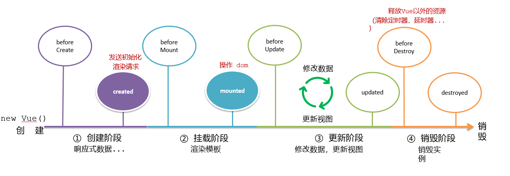
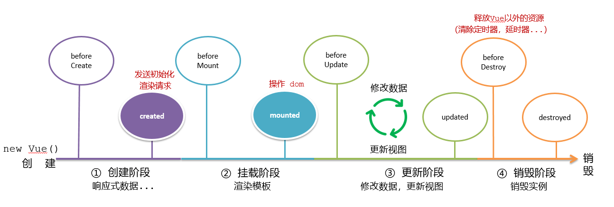
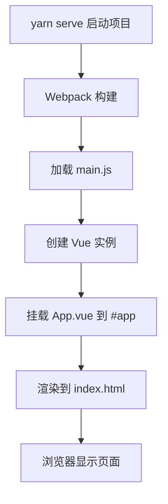

# 知识手册 第二辑

<details><summary>Vue</summary>

## Vue

### Vue 基础概念

#### 创建Vue实例

**概念**：Vue实例是Vue应用的根实例，通过new Vue()创建，它将数据和DOM进行绑定，实现响应式的数据驱动视图更新。

**创建步骤**：
1. 准备HTML容器
2. 引入Vue.js库
3. 创建Vue实例
4. 添加配置项完成渲染

**模板代码**：
```html
<!-- 1. 准备容器 -->
<div id="app">
  <!-- Vue管理的区域 -->
</div>

<!-- 2. 引入Vue库 -->
<script src="./vue.js"></script>
```

```javascript
// 3. 创建Vue实例
const app = new Vue({
  // 4. 配置选项
  el: '选择器',           // 指定Vue管理的DOM元素
  data: {                // 响应式数据
    属性名: 初始值
  },
  methods: {             // 方法定义
    方法名() {
      // 方法体
    }
  },
  computed: {            // 计算属性
    计算属性名() {
      return 计算结果;
    }
  },
  watch: {               // 侦听器
    被侦听属性(newVal, oldVal) {
      // 处理逻辑
    }
  }
});
```

**基础示例**：
```javascript
// 创建Vue实例
const app = new Vue({
  // el: 配置选择器，指定Vue管理的是哪个盒子
  el: '#app',
  
  // data：提供数据
  data: {
    msg: 'Hello, Vue!',
    num: 123456,
    isVisible: true
  },
  
  // methods：定义方法
  methods: {
    handleClick() {
      this.isVisible = !this.isVisible;
    }
  }
})
```

#### 响应式特征

Vue的核心特性之一是响应式数据绑定：
- 数据改变，视图自动更新
- data中的数据，最终会被添加到实例上
- 访问数据：`实例.属性`，如 `app.msg`
- 修改数据：`实例.属性 = '值'`，如 `app.msg = 'hello'`

### Vue 模板语法

#### 插值表达式

**概念**：插值表达式是Vue的核心模板语法，使用双大括号`{{ }}`将Vue实例中的数据渲染到HTML模板中，实现数据的动态显示。

**模板语法**：
```html
<!-- 基础语法 -->
{{ 数据属性 }}

<!-- 表达式计算 -->
{{ 数学表达式 }}
{{ 字符串拼接 }}
{{ 三元运算符 }}
{{ 方法调用 }}

<!-- 对象属性访问 -->
{{ 对象.属性 }}
{{ 数组[索引] }}
```

**使用规则**：
1. 使用的数据必须在data中声明
2. 支持JavaScript表达式，不支持语句（如if、for、while等）
3. 不能在HTML属性中使用（需要用v-bind）
4. 每个插值表达式只能包含单个表达式

**基础示例**：
```html
<div id="app">
  <!-- 简单数据显示 -->
  <p>{{ nickname }}</p>
  
  <!-- 方法调用 -->
  <p>{{ nickname.toUpperCase() }}</p>
  
  <!-- 字符串拼接 -->
  <p>{{ nickname + ' how are you!' }}</p>
  
  <!-- 三元运算符 -->
  <p>{{ age >= 18 ? '成年' : '未成年' }}</p>
  
  <!-- 对象属性访问 -->
  <p>{{ friends.name + ' ' + friends.desc }}</p>
  
  <!-- 数学运算 -->
  <p>{{ price * quantity }}</p>
  
  <!-- 数组访问 -->
  <p>{{ list[0] }}</p>
</div>
```

```javascript
data: {
  nickname: 'Vue',
  age: 20,
  friends: {
    name: '小明',
    desc: '我的好朋友'
  },
  price: 10,
  quantity: 3,
  list: ['苹果', '香蕉', '橙子']
}
```

### Vue 指令

Vue指令是带有`v-`前缀的特殊属性，不同属性对应不同的功能。

#### v-html

动态设置元素的innerHTML。

**语法**：`v-html="表达式"`

```html
<div v-html="msg"></div>
```

```javascript
data: {
  msg: `<a href="https://apple.com.cn/" target="_blank">苹果官网</a>`
}
```

#### v-show 和 v-if

都可以控制元素的显示隐藏。

**语法**：`v-show="表达式"`、`v-if="表达式"`

**差异**：
- `v-show`：通过控制CSS属性`display: none`来隐藏元素
- `v-if`：控制DOM元素的创建与否
- `v-show`适合频繁切换的场景，`v-if`适合条件不经常改变的场景

```html
<div v-show="flag" v-html="msg"></div>
<div v-if="flag" v-html="msg"></div>
```

#### v-else 和 v-else-if

辅助`v-if`进行条件渲染。

**语法**：
- `v-if="表达式" + v-else`
- `v-if="表达式" + v-else-if="表达式" + v-else`

**注意**：`v-else`一定要配合`v-if`使用

```html
<p v-if="score >= 90">成绩评定A：奖励电脑一台</p>
<p v-else-if="score >= 70">成绩评定B：奖励周末郊游</p>
<p v-else-if="score >= 60">成绩评定C：奖励零食礼包</p>
<p v-else>成绩评定D：惩罚一周不能玩手机</p>
```

#### v-on 事件监听

**概念**：v-on指令用于监听DOM事件，当事件触发时执行相应的JavaScript代码或调用方法。

**模板语法**：
```html
<!-- 基础语法 -->
<button v-on:事件名="处理逻辑">按钮</button>

<!-- 简写语法 -->
<button @事件名="处理逻辑">按钮</button>

<!-- 内联语句 -->
<button @click="变量++">按钮</button>

<!-- 调用方法 -->
<button @click="方法名">按钮</button>

<!-- 调用方法并传参 -->
<button @click="方法名(参数)">按钮</button>
```

**语法1 - 内联语句**：直接在模板中编写简单的JavaScript表达式

```html
<button v-on:click="count--">-</button>
<button @click="count++">+</button>
<button @click="flag = !flag">切换</button>
```

**语法2 - 调用方法**：调用methods中定义的方法

```html
<button @click="fn">控制显隐</button>
```

```javascript
methods: {
  fn() {
    // methods函数内的this指向Vue实例
    this.flag = !this.flag
  }
}
```

**语法3 - 调用传参**：在事件处理中传递参数

```html
<button @click="fn(5)">可乐5元</button>
<button @click="fn(10)">咖啡10元</button>
<button @click="handleDelete(item.id)">删除</button>
```

```javascript
methods: {
  fn(price) {
    this.money -= price;
  },
  handleDelete(id) {
    this.list = this.list.filter(item => item.id !== id);
  }
}
```

#### v-bind 属性绑定

**概念**：v-bind指令用于**动态**绑定HTML属性，可以将Vue实例的数据绑定到元素的属性上，实现**属性值的动态更新**。

**模板语法**：
```html
<!-- 基础语法 -->
<元素 v-bind:属性名="表达式"></元素>

<!-- 简写语法 -->
<元素 :属性名="表达式"></元素>

<!-- 常用属性绑定 -->

<a :href="链接变量">链接</a>
<div :id="id变量"></div>
<input :value="值变量">
<button :disabled="布尔变量">按钮</button>
```

**基础示例**：
```html


<a :href="link">{{ linkText }}</a>
<input :placeholder="placeholderText">
```

```javascript
data: {
  url: 'https://example.com/image.jpg',
  msg: '这是一张图片',
  link: 'https://vue.js.org',
  linkText: 'Vue官网',
  placeholderText: '请输入内容'
}
```

#### v-for 列表渲染

**概念**：v-for指令用于基于数组、对象或数字进行循环渲染，可以将数据列表渲染为DOM元素列表。

**模板语法**：
```html
<!-- 遍历数组 -->
<li v-for="(item, index) in 数组" :key="唯一标识">
  {{ item }} - {{ index }}
</li>

<!-- 遍历对象 -->
<li v-for="(value, key, index) in 对象" :key="key">
  {{ key }}: {{ value }} - {{ index }}
</li>

<!-- 遍历数字 -->
<li v-for="n in 数字" :key="n">
  {{ n }}
</li>
```

**参数说明**：
- `item`：当前遍历的元素值
- `index`：当前遍历元素的索引（可选）
- `value`：对象的属性值
- `key`：对象的属性名
- `n`：数字遍历时的当前数字

**数组遍历示例**：
```html
<ul>
  <!-- 简单数组 -->
  <li v-for="(fruit, index) in fruits" :key="index">
    {{ index + 1 }}. {{ fruit }}
  </li>
  
  <!-- 对象数组 -->
  <li v-for="(item, index) in list" :key="item.id">
    {{ item.name }} - {{ item.price }}元
  </li>
</ul>
```

```javascript
data: {
  fruits: ['苹果', '香蕉', '橙子'],
  list: [
    { id: 1, name: '苹果', price: 5 },
    { id: 2, name: '香蕉', price: 3 },
    { id: 3, name: '橙子', price: 4 }
  ]
}
```

**v-for中的key属性**：

**概念**：key是Vue用于跟踪列表项变化的特殊属性，帮助Vue高效地更新虚拟DOM。

**重要性**：
- 给元素添加唯一标识，便于Vue进行列表项的正确排序和复用
- 提高列表渲染性能，避免不必要的DOM操作
- 确保组件状态的正确维护

**使用规则**：
- key的值只能是字符串或数字类型
- key的值必须具有唯一性
- 推荐使用数据的id作为key
- 不推荐使用index作为key（会导致性能问题）

```html
<!-- 推荐：使用唯一id -->
<li v-for="item in list" :key="item.id">{{ item.name }}</li>

<!-- 不推荐：使用index -->
<li v-for="(item, index) in list" :key="index">{{ item.name }}</li>
```

#### v-model 双向数据绑定

**概念**：v-model是Vue提供的**双向数据绑定指令**，**专门用于表单元素**，实现数据与视图的同步更新。

**模板语法**：
```html
<!-- 基础语法 -->
<input v-model="变量名">

<!-- 不同表单元素的使用 -->
<input type="text" v-model="文本变量">
<input type="checkbox" v-model="布尔变量">
<input type="radio" v-model="选择变量">
<select v-model="选项变量">
<textarea v-model="文本变量"></textarea>
```

**作用**：
- 数据变化，视图自动更新
- 视图变化，数据自动更新
- 可以快速获取或设置表单元素内容

**基础示例**：
```html
<form>
  用户：<input type="text" v-model="username"> <br>
  密码：<input type="password" v-model="password"> <br>
  <button @click="login">登录</button>
  <button @click="reset">重置</button>
</form>
```

```javascript
data: {
  username: '',
  password: ''
},
methods: {
  login() {
    console.log(this.username, this.password);
  },
  reset() {
    this.username = '';
    this.password = '';
  }
}
```

**应用于其他表单元素**：

```html
<!-- 复选框 -->
是否单身：<input type="checkbox" v-model="isSingle">

<!-- 单选框 -->
性别: 
<input type="radio" name="gender" value="1" v-model="gender">男
<input type="radio" name="gender" value="0" v-model="gender">女

<!-- 下拉选择 -->
所在城市:
<select v-model="cityID">
  <option value="101">北京</option>
  <option value="102">上海</option>
  <option value="103">成都</option>
</select>

<!-- 文本域 -->
自我描述：<textarea v-model="desc"></textarea>
```

```javascript
data: {
  isSingle: true,
  gender: '1',
  cityID: '102',
  desc: 'Hello'
}
```

### Vue 指令修饰符

**概念**：指令修饰符是Vue指令的扩展功能，用于增强指令的行为，通过在指令后添加`.修饰符`的方式使用。

#### 按键修饰符

**模板语法**：
```html
<!-- 监听特定按键事件 -->
<input @keyup.按键名="处理函数">
<input @keydown.按键名="处理函数">
```

**常用按键修饰符**：
- `.enter` - 回车键
- `.tab` - Tab键
- `.delete` - 删除键
- `.esc` - Esc键
- `.space` - 空格键
- `.up/.down/.left/.right` - 方向键

**示例**：
```html
<input @keyup.enter="fn" v-model="username">
```

```javascript
methods: {
  fn() {
    console.log(this.username);
  }
}
```

#### 事件修饰符

**模板语法**：
```html
<!-- 阻止事件冒泡 -->
<button @click.stop="处理函数">按钮</button>

<!-- 阻止默认行为 -->
<a @click.prevent="处理函数">链接</a>

<!-- 链式调用 -->
<button @click.stop.prevent="处理函数">按钮</button>
```

**常用事件修饰符**：
- `.stop` - 阻止事件冒泡
- `.prevent` - 阻止默认行为
- `.capture` - 添加事件监听器时使用事件捕获模式
- `.self` - 只当在 event.target 是当前元素自身时触发处理函数
- `.once` - 事件只触发一次

#### v-model修饰符

**模板语法**：
```html
<!-- 去除首尾空格 -->
<input v-model.trim="变量名">

<!-- 转换为数字类型 -->
<input v-model.number="变量名">

<!-- 懒更新（失去焦点时更新） -->
<input v-model.lazy="变量名">
```

**示例**：
```html
姓名：<input v-model.trim="username">
年龄：<input v-model.number="age">
```

### v-bind 样式控制

**概念**：v-bind不仅可以绑定普通属性，还可以专门用于动态控制元素的class和style，实现样式的动态切换。

#### 控制class类名

**模板语法**：
```html
<!-- 对象语法：根据布尔值控制类名 -->
<div :class="{ 类名1: 布尔值1, 类名2: 布尔值2 }"></div>

<!-- 数组语法：批量添加类名 -->
<div :class="['类名1', '类名2', 条件 ? '类名3' : '']"></div>

<!-- 混合使用 -->
<div :class="[基础类名, { 动态类名: 条件 }]"></div>
```

**对象语法示例**：
```html
<div :class="{ active: isActive, disabled: isDisabled }">内容</div>
```

```javascript
data: {
  isActive: true,
  isDisabled: false
}
// 渲染结果：<div class="active">内容</div>
```

**数组语法示例**：
```html
<div :class="['box', 'container', isActive ? 'active' : '']">内容</div>
```

#### 控制style样式

**模板语法**：
```html
<!-- 对象语法：动态设置内联样式 -->
<div :style="{ CSS属性名: '值', CSS属性名: 变量 }"></div>

<!-- 数组语法：应用多个样式对象 -->
<div :style="[样式对象1, 样式对象2]"></div>
```

**示例**：
```html
<div :style="{ width: '300px', height: '300px', backgroundColor: 'darkcyan' }"></div>
<div :style="{ width: percent + '%' }">进度条</div>
```

```javascript
data: {
  percent: 50
}
```

### 计算属性 computed

**概念**：计算属性是基于现有数据计算出来的新属性，具有缓存特性，只有当依赖的数据发生变化时才会重新计算。

**模板语法**：
```javascript
computed: {
  计算属性名() {
    // 基于现有数据的计算逻辑
    return 计算结果;
  }
}
```

**基础示例**：
```javascript
computed: {
  totalCount() {
    // 计算礼物总数
    return this.list.reduce((prev, curr) => prev + curr.num, 0);
  }
}
```

```html
<p>礼物总数：{{ totalCount }} 个</p>
```

#### 计算属性 vs 方法

**计算属性特点**：
- 基于响应式依赖进行缓存
- 只有相关响应式依赖发生改变时才会重新求值
- 多次访问会立即返回之前的计算结果
- 作为属性使用：`{{ 计算属性名 }}`

**方法特点**：
- 每次调用都会重新执行
- 没有缓存机制
- 作为方法调用：`{{ 方法名() }}`

**对比示例**：
```javascript
// 计算属性 - 有缓存
computed: {
  totalCount() {
    console.log('计算属性执行'); // 只打印一次
    return this.list.reduce((sum, item) => sum + item.num, 0);
  }
},
// 方法 - 无缓存
methods: {
  totalCountFn() {
    console.log('方法执行'); // 每次调用都打印
    return this.list.reduce((acc, item) => acc + item.num, 0);
  }
}
```

#### 计算属性完整写法

**模板语法**：
```javascript
computed: {
  计算属性名: {
    // 获取值时调用
    get() {
      return 计算结果;
    },
    // 设置值时调用
    set(newValue) {
      // 处理设置逻辑
    }
  }
}
```

**示例**：
```javascript
computed: {
  fullName: {
    get() {
      return this.firstName + this.lastName;
    },
    set(val) {
      this.firstName = val.slice(0, 1);
      this.lastName = val.slice(1);
    }
  }
}
```

### 侦听器 watch

**概念**：侦听器用于观察和响应Vue实例上数据的变化，当被侦听的数据发生变化时，会执行相应的回调函数。

#### 简单写法

**模板语法**：
```javascript
watch: {
  // 侦听根级别属性
  属性名(newVal, oldVal) {
    // 处理逻辑
  },
  // 侦听对象中的属性（需要加引号）
  'obj.属性名'(newVal, oldVal) {
    // 处理逻辑
  }
}
```

**示例**：
```javascript
watch: {
  'obj.words'(newVal) {
    // 防抖处理
    if (this.timer) clearTimeout(this.timer);
    this.timer = setTimeout(async () => {
      const res = await axios({
        url: 'https://api.example.com/translate',
        params: { words: newVal }
      });
      this.result = res.data.data;
    }, 300);
  }
}
```

#### 完整写法

**模板语法**：
```javascript
watch: {
  属性名: {
    deep: true,      // 深度监听
    immediate: true, // 立即执行
    handler(newVal, oldVal) {
      // 处理逻辑
    }
  }
}
```

**配置选项**：
- `deep: true` - 深度监听，监听对象内部值的变化
- `immediate: true` - 立即执行一次handler
- `handler` - 具体的处理函数

**示例**：
```javascript
watch: {
  obj: {
    deep: true,
    immediate: true,
    handler(newVal) {
      // 只要obj中任意属性发生变化都会触发
      localStorage.setItem('data', JSON.stringify(newVal));
    }
  }
}
```

### Vue 实例配置项

#### data 数据

**概念**：data选项用于声明组件的响应式数据，Vue会将data中的属性转换为响应式属性。

**模板语法**：
```javascript
data: {
  属性名: 初始值,
  对象属性: {},
  数组属性: []
}
```

**示例**：
```javascript
data: {
  msg: 'Hello Vue',
  count: 0,
  user: {
    name: '张三',
    age: 18
  },
  list: ['apple', 'banana', 'orange']
}
```

#### methods 方法

**概念**：methods选项用于定义组件的方法，方法内的`this`自动绑定到Vue实例。

**模板语法**：
```javascript
methods: {
  方法名(参数1, 参数2) {
    // 方法体
    // this指向Vue实例
    return 返回值; // 可选
  }
}
```

**示例**：
```javascript
methods: {
  handleClick() {
    // this指向Vue实例
    this.count++;
  },
  handleDelete(id) {
    this.list = this.list.filter(item => item.id !== id);
  },
  async fetchData() {
    const res = await axios.get('/api/data');
    this.data = res.data;
  }
}
```

#### computed 计算属性

**概念**：computed选项用于定义计算属性，基于现有数据计算出新的属性值。

**模板语法**：
```javascript
computed: {
  计算属性名() {
    return 基于data的计算结果;
  }
}
```

#### watch 侦听器

**概念**：watch选项用于侦听数据变化，当数据发生变化时执行相应的回调函数。

**模板语法**：
```javascript
watch: {
  被侦听的属性名(newVal, oldVal) {
    // 变化时的处理逻辑
  }
}
```

### Vue 实例生命周期

#### 概念

**概念**：Vue实例从创建到销毁的过程，每个阶段都有特定的钩子函数可以调用。Vue生命周期是指Vue实例从创建到销毁的整个过程，在这个过程中会自动执行一些函数，这些函数被称为生命周期钩子函数。

**生命周期四个阶段**：① 创建 ② 挂载 ③ 更新 ④ 销毁

1. **创建阶段**：创建响应式数据
2. **挂载阶段**：渲染模板
3. **更新阶段**：修改数据，更新视图
4. **销毁阶段**：销毁Vue实例



#### 生命周期钩子（hook）

Vue生命周期过程中，会**自动运行一些函数**，被称为【**生命周期钩子**】→ 让开发者可以在【**特定阶段**】运行**自己的代码**



**八大生命周期钩子**：

**1. 创建阶段**：
- `beforeCreate`：实例初始化后，数据观测和事件配置之前调用，此时data和methods都不可用
- `created`：实例创建完成，数据观测和事件配置完成，但DOM未挂载，**常用于发送初始化请求**

**2. 挂载阶段**：
- `beforeMount`：挂载开始前调用，模板编译完成但未挂载到页面
- `mounted`：实例挂载完成，DOM已挂载，**常用于DOM操作**

**3. 更新阶段**：
- `beforeUpdate`：数据更新时调用，发生在虚拟DOM打补丁之前
- `updated`：数据更新后调用，发生在虚拟DOM打补丁之后

**4. 销毁阶段**：
- `beforeDestroy`：实例销毁前调用，实例仍然完全可用
- `destroyed`：实例销毁后调用，所有事件监听器被移除

**模板代码**：
```javascript
const app = new Vue({
  el: '#app',
  data: {
    count: 100,
    title: '计数器'
  },

  // 八大钩子函数
  // 1. 创建阶段
  beforeCreate() {
    console.log('beforeCreate 响应式数据未准备', this.count);
    // this.count 输出 undefined
  },

  created() {
    console.log('created 数据准备完毕', this.count);
    // 常用于：发送初始化请求，获取数据
  },

  // 2. 挂载阶段
  beforeMount() {
    console.log('beforeMount DOM未被渲染', document.querySelector('span').innerHTML);
    // 输出 {{ count }}
  },

  mounted() {
    console.log('mounted DOM已渲染', document.querySelector('span').innerHTML);
    // 常用于：DOM操作，如获取焦点、初始化图表等
  },

  // 3. 更新阶段
  beforeUpdate() {
    // 需要有数据更新，才会触发更新阶段
    console.log('beforeUpdate 数据更新了，DOM未更新', document.querySelector('span').innerHTML);
  },
  updated() {
    console.log('updated 数据更新了，DOM也更新了', document.querySelector('span').innerHTML);
  },

  // 4. 销毁阶段
  // 在控制台中，使用 app.$destroy() 销毁组件
  beforeDestroy() {
    console.log('beforeDestroy 组件销毁前');
  },
  destroyed() {
    console.log('destroyed 组件销毁后, 此时点击dom元素不再有响应');
  }
})
```

#### created 应用场景

**概念**：created钩子在Vue实例创建完成后立即调用，此时数据观测和事件配置已完成，但DOM还未挂载。

**适用场景**：
- 发送初始化请求获取数据
- 进行数据的初始化处理
- 启动定时器
- 订阅消息

**模板代码**：
```javascript
async created() {
  // 发送请求获取数据
  const res = await axios.get('接口地址');
  this.数据属性 = res.data.data;
}
```

**实际应用 - 新闻列表**：
```javascript
const app = new Vue({
  el: '#app',
  data: {
    newsList: []
  },
  async created() {
    // 页面加载完成后立即获取新闻数据
    const res = await axios.get('http://hmajax.itheima.net/api/news');
    this.newsList = res.data.data;
  }
})
```

```html
<ul>
  <li class="news" v-for="(item, index) in newsList" :key="item.id">
    <div class="left">
      <div class="title">{{ item.title }}</div>
      <div class="info">
        <span>{{ item.source }}</span>
        <span>{{ item.time }}</span>
      </div>
    </div>
    <div class="right">
      
    </div>
  </li>
</ul>
```

#### mounted 应用场景

**概念**：mounted钩子在Vue实例挂载完成后调用，此时DOM已经渲染完成，可以进行DOM操作。

**适用场景**：
- DOM操作（获取焦点、获取元素尺寸等）
- 初始化第三方库（如图表库、地图等）
- 启动轮播图等需要DOM的功能

**模板代码**：
```javascript
mounted() {
  // DOM操作
  document.querySelector('#元素id').focus();
  
  // 初始化第三方库
  this.chart = echarts.init(document.querySelector('#chart'));
}
```

**实际应用 - 输入框获取焦点**：
```javascript
const app = new Vue({
  el: '#app',
  data: {
    words: ''
  },
  mounted() {
    // 等待输入框渲染完毕后获取焦点
    document.querySelector('#inp').focus();
  }
})
```

```html
<div class="search-box">
  <input type="text" v-model="words" id="inp">
  <button>搜索一下</button>
</div>
```

**实际应用 - 初始化图表**：
```javascript
const app = new Vue({
  el: '#app',
  data: {
    list: []
  },
  mounted() {
    // echarts 使用 → 3步走（前提：已经引入了 echarts 库）

    //  1. 初始化echarts图表
    // 声明变量时，由于需要在外部函数中使用 setOption 函数以动态更新图表，所以提升变量，将 myChart 挂载到 Vue 实例上
    this.myChart = echarts.init(document.querySelector('#main'));
    
    // 2. 配置图表选项
    this.option = {
      title: {
        text: '消费账单占比',
        left: 'center'
      },
      tooltip: {
        trigger: 'item'
      },
      series: [{
        name: '消费账单',
        type: 'pie',
        radius: '50%',
        data: []
      }]
    };
    
    // 3. 使用配置项显示图表
    // 注意统一使用 this，因为该变量统一挂载到了实例上；没有 this 则会出现未定义报错
    this.myChart.setOption(this.option);
  }
})
```

#### 生命周期综合案例 - 小黑记账清单

**功能需求**：
1. 页面加载时获取账单数据（created）
2. DOM渲染完成后初始化图表（mounted）
3. 添加、删除账单功能
4. 实时更新饼图显示

**完整实现**：
```javascript
const app = new Vue({
  el: '#app',
  data: {
    list: [],
    name: '',
    price: ''
  },
  
  computed: {
    totalPrice() {
      return this.list.reduce((prev, curr) => prev + curr.price, 0);
    }
  },
  
  // 1. 页面加载时获取数据
  created() {
    this.renderer();
  },
  
  // 2. DOM渲染完成后初始化图表
  mounted() {
    // 初始化echarts实例
    this.myChart = echarts.init(document.querySelector('#main'));
    
    // 配置图表选项
    this.option = {
      title: {
        text: '消费账单占比',
        left: 'center'
      },
      tooltip: {
        trigger: 'item'
      },
      legend: {
        orient: 'vertical',
        left: 'left'
      },
      series: [{
        name: '消费账单',
        type: 'pie',
        radius: '50%',
        data: [],
        emphasis: {
          itemStyle: {
            shadowBlur: 10,
            shadowOffsetX: 0,
            shadowColor: 'rgba(0, 0, 0, 0.5)'
          }
        }
      }]
    };
    
    this.myChart.setOption(this.option);
  },
  
  methods: {
    // 渲染数据和图表
    async renderer() {
      const res = await axios.get('https://applet-base-api-t.itheima.net/bill', {
        // get 方法需要单独的 params 对象
        params: {
          creator: 'StelleRainn'
        }
      });
      this.list = res.data.data;
      
      // 更新图表数据
      if (this.myChart) {
        this.myChart.setOption({
          // 需要修改什么，就修改什么
          series: [{
            // 注意加上括号以避免对象被识别为函数体或代码段
            data: this.list.map(curr => ({
              value: curr.price, 
              name: curr.name
            }))
          }]
        });
      }
    },
    
    // 添加账单
    async addItem() {
      // 校验表单数据
      if (!this.name.trim() || !this.price) {
        alert('请填写完整信息');
        return;
      }
      
      await axios.post('https://applet-base-api-t.itheima.net/bill', {
        creator: 'StelleRainn',
        name: this.name,
        price: this.price
      });
      
      // 重新渲染
      this.renderer();
      
      // 清空表单
      this.name = '';
      this.price = '';
    },
    
    // 删除账单
    async delItem(id) {
      await axios.delete('https://applet-base-api-t.itheima.net/bill/' + id);
      this.renderer();
    }
  }
})
```

```html
<div id="app">
  <div class="contain">
    <!-- 左侧列表 -->
    <div class="list-box">
      <!-- 添加表单 -->
      <form class="my-form">
        <input v-model="name" type="text" placeholder="消费名称" />
        <input v-model="price" type="text" placeholder="消费价格" />
        <button type="button" @click="addItem">添加账单</button>
      </form>
      
      <!-- 账单列表 -->
      <table class="table table-hover">
        <thead>
          <tr>
            <th>编号</th>
            <th>消费名称</th>
            <th>消费价格</th>
            <th>操作</th>
          </tr>
        </thead>
        <tbody>
          <tr v-for="(item, index) in list" :key="item.id">
            <td>{{ index + 1 }}</td>
            <td>{{ item.name }}</td>
            <td :class="{ red: item.price > 178 }">{{ item.price.toFixed(2) }}</td>
            <td><a href="javascript:;" @click="delItem(item.id)">删除</a></td>
          </tr>
        </tbody>
        <tfoot>
          <tr>
            <td colspan="4">消费总计： {{ totalPrice.toFixed(2) }}</td>
          </tr>
        </tfoot>
      </table>
    </div>
    
    <!-- 右侧图表 -->
    <div class="echarts-box" id="main"></div>
  </div>
</div>
```

### 工程化开发与脚手架

#### 开发 Vue 的两种方式

- 核心包传统开发模式：基于html / css / js 文件，直接引入核心包，开发 Vue。
- **工程化开发模式：基于构建工具（例如：webpack）的环境中开发Vue。**

**工程化开发模式的优势**：
- 提供了项目的结构和组织方式，方便开发和维护。
- 集成了代码转换、压缩、热更新等功能，支持新语法（如ES6+，LESS，Sass，TS等）和新特性（如组件化），提高开发效率。
- 支持模块化开发，方便代码的拆分和复用。
- 提供了丰富的插件和工具，满足不同项目的需求。

#### 脚手架 Vue CLI

##### 基本介绍

Vue CLI 是Vue官方提供的一个**全局命令工具**

可以帮助我们**快速创建**一个开发Vue项目的**标准化基础架子**。【集成了webpack配置】

##### 好处：

1. 开箱即用，零配置
2. 内置babel等工具
3. 标准化的webpack配置

##### 使用步骤：

1. **全局安装**（只需安装一次即可）
   ```bash
   # 使用 yarn
   yarn global add @vue/cli
   # 或使用 npm
   npm i @vue/cli -g
   ```

2. **查看版本**
   ```bash
   vue --version
   ```

3. **创建项目**
   ```bash
   vue create project-name
   ```
   > 注意：项目名不能使用中文，建议使用小写字母和连字符

4. **启动项目**
   ```bash
   # 进入项目目录
   cd project-name
   # 启动开发服务器
   yarn serve
   # 或
   npm run serve
   ```
   > 具体命令可在 package.json 的 scripts 字段中查看

5. **备注**

   `node_modules`一般不会被git所添加，在其他设备使用`git clone`同步后，需要运行`yarn install`来保证模块被安装。

##### 创建项目时的配置选项

- **Default ([Vue 2] babel, eslint)**：默认配置，适合快速开始
- **Default ([Vue 3] babel, eslint)**：Vue 3 默认配置
- **Manually select features**：手动选择功能，可自定义配置
  - Babel：ES6+ 语法转换
  - TypeScript：TypeScript 支持
  - Progressive Web App (PWA) Support：PWA 支持
  - Router：Vue Router 路由
  - Vuex：状态管理
  - CSS Pre-processors：CSS 预处理器（Sass/Less/Stylus）
  - Linter / Formatter：代码检查和格式化
  - Unit Testing：单元测试
  - E2E Testing：端到端测试

#### 项目结构与运行流程

##### 项目目录结构

```
project-name/
├── node_modules/           # 项目依赖的模块（自动生成，不需要手动修改）
├── public/                 # 静态资源目录（不会被webpack处理）
│   ├── index.html         # 项目的入口HTML模板文件
│   └── favicon.ico        # 网站图标
├── src/                   # 项目的源代码目录（开发的主要工作区域）
│   ├── assets/            # 静态资源目录（会被webpack处理）
│   │   ├── images/        # 图片资源
│   │   ├── styles/        # 样式文件
│   │   └── fonts/         # 字体文件
│   ├── components/        # 可复用组件目录
│   │   ├── BaseComponent.vue
│   │   └── CommonComponent.vue
│   ├── views/             # 页面级组件目录（路由组件）
│   │   ├── Home.vue
│   │   └── About.vue
│   ├── router/            # 路由配置目录
│   │   └── index.js
│   ├── store/             # 状态管理目录（Vuex）
│   │   └── index.js
│   ├── utils/             # 工具函数目录
│   │   └── request.js
│   ├── App.vue            # 项目的根组件
│   └── main.js            # 项目的入口JS文件
├── package.json           # 项目的依赖配置文件
├── package-lock.json      # 依赖版本锁定文件
├── README.md              # 项目的说明文档
├── .gitignore             # Git忽略文件配置
├── babel.config.js        # Babel配置文件
└── vue.config.js          # Vue CLI配置文件（可选）
```

##### 核心文件说明

- **src/main.js**：项目入口文件，负责创建Vue实例并挂载到DOM
- **src/App.vue**：根组件，所有其他组件的父组件
- **public/index.html**：HTML模板，Vue应用最终会挂载到这里
- **package.json**：项目配置文件，包含依赖、脚本命令等信息

##### 重点文件详解

1. **main.js** - 项目入口文件
   ```javascript
   import { createApp } from 'vue'
   import App from './App.vue'
   
   createApp(App).mount('#app')
   ```

2. **App.vue** - 根组件
   ```vue
   <template>
     <div id="app">
       <!-- 应用内容 -->
     </div>
   </template>
   
   <script>
   export default {
     name: 'App'
   }
   </script>
   
   <style>
   /* 全局样式 */
   </style>
   ```

3. **index.html** - HTML模板文件
   ```html
   <!DOCTYPE html>
   <html lang="">
     <head>
       <meta charset="utf-8">
       <title>Vue App</title>
     </head>
     <body>
       <div id="app"></div>
       <!-- built files will be auto injected -->
     </body>
   </html>
   ```

##### 项目运行流程



**详细步骤：**
1. 执行 `yarn serve` 启动开发服务器
2. Webpack 开始构建项目，处理各种文件类型
3. 自动加载 `src/main.js` 入口文件
4. `main.js` 创建 Vue 应用实例并引入 `App.vue`
5. Vue 将 `App.vue` 组件渲染并挂载到 `public/index.html` 中的 `#app` 元素
6. 浏览器接收处理后的 HTML、CSS、JS 文件并显示页面
7. 开发服务器启动热重载，文件变化时自动刷新页面


#### 组件化开发

##### 基本介绍

组件化开发是指将一个复杂的应用拆分成多个组件，每个组件负责完成特定的功能，组件之间可以组合起来完成整个应用的功能。

##### 好处：

1. 代码复用：组件可以被多个地方使用，避免重复编写代码。
2. 维护方便：组件化开发使得代码结构清晰，维护方便。
3. 开发效率高：组件化开发使得开发效率高，开发周期短。

##### 组件化开发的实现方式

1. 全局组件：在main.js文件中注册组件，全局可用。
2. 局部组件：在需要使用的组件中注册组件，只在当前组件可用。

##### 根组件 App.vue

整个应用最上层的组件，包裹所有的小组件（类似树的根节点）

##### 组件的三个组成部分

1. **`<template>`**：组件的模板，定义组件的结构和内容
   ```vue
   <template>
     <div class="my-component">
       <h1>{{ title }}</h1>
       <p>{{ content }}</p>
     </div>
   </template>
   ```

2. **`<script>`**：JavaScript逻辑，定义组件的行为和逻辑
   ```vue
   <script>
   export default {
     name: 'MyComponent',
     data() {
       return {
         title: '组件标题',
         content: '组件内容'
       }
     },
     methods: {
       handleClick() {
         console.log('按钮被点击')
       }
     }
   }
   </script>
   ```

3. **`<style>`**：组件的样式，定义组件的外观和布局
   ```vue
   <style scoped>
   .my-component {
     padding: 20px;
     border: 1px solid #ccc;
   }
   </style>
   ```

##### 样式作用域和预处理器

- **scoped 属性**：使样式只作用于当前组件
  ```vue
  <style scoped>
  /* 样式只在当前组件生效 */
  </style>
  ```

- **CSS 预处理器支持**：
  ```bash
  # 安装 Less
  yarn add less less-loader -D
  
  # 安装 Sass
  yarn add sass sass-loader -D
  ```
  
  ```vue
  <style lang="less" scoped>
  @primary-color: #007bff;
  
  .my-component {
    color: @primary-color;
    
    &:hover {
      opacity: 0.8;
    }
  }
  </style>
  ```

##### 普通组件的注册使用-局部注册

顾名思义，只能在注册的组件内使用。

**步骤**：

1. 在components目录下创建组件文件（例如：MyComponent.vue）
2. 在需要使用的组件中引入组件文件
   ```javascript
   import MyComponent from '@/components/MyComponent.vue'
   ```
3. 在组件中注册组件
   ```javascript
   export default {
     components: {
      <!-- 同名变量简写 -->
       MyComponent
     }
   }
   ```
4. 在组件的模板中使用组件, 当成html标签使用即可
   ```html
   <MyComponent><MyComponent />
   ```
   *p.s. 组件命名规范：大驼峰命名法*

##### 普通组件的注册使用-全局注册

全局注册的组件，在项目的**任何组件**中都可以使用。

**步骤**：

1. 在components目录下创建组件文件（例如：GlobalComponent.vue）
2. 在***main.js***文件中引入组件文件
   ```javascript
   import GlobalComponent from '@/components/GlobalComponent.vue'
   ```
3. 在***main.js***文件中注册组件
   ```javascript
   Vue.component('GlobalComponent', GlobalComponent)
   ```
4. 在组件的模板中使用组件, 当成html标签使用即可
   ```html
   <GlobalComponent><GlobalComponent />
   ```

*p.s. 通常在 IDE 内，可以先完成步骤 3，语法补全会自动引入步骤 2 中的代码*

##### 组件开发最佳实践

**1. 组件命名规范**
- 使用 PascalCase（大驼峰）命名：`MyComponent.vue`
- 组件名应该具有描述性：`UserProfile.vue`、`ProductCard.vue`
- 避免与HTML标签冲突：不要使用 `Header.vue`，可以用 `AppHeader.vue`

**2. 组件文件组织**
```
src/
├── components/
│   ├── common/           # 通用组件
│   │   ├── BaseButton.vue
│   │   ├── BaseInput.vue
│   │   └── BaseModal.vue
│   ├── layout/           # 布局组件
│   │   ├── AppHeader.vue
│   │   ├── AppSidebar.vue
│   │   └── AppFooter.vue
│   └── business/         # 业务组件
│       ├── UserProfile.vue
│       └── ProductList.vue
```


##### 组件化开发 综合案例 小兔鲜组件化

```html
 <!-- App.vue -->
  <template>
  <div id="app">
    <!-- 快捷链接 -->
    <XtxShortCut></XtxShortCut>
    <!-- 顶部导航 -->
    <XtxHeaderNav></XtxHeaderNav>
    <!-- 轮播区域 -->
    <XtxBanner></XtxBanner>
    <!-- 新鲜好物 -->
    <XtxNewGoods></XtxNewGoods>
    <!-- 热门品牌 -->
    <XtxHotBrand></XtxHotBrand>
    <!-- 最新专题 -->
    <XtxTopic></XtxTopic>
    <!-- 版权底部 -->
    <XtxFooter></XtxFooter>
  </div>
</template>

<script>

// 引入组件
import XtxShortCut from './components/XtxShortCut'
import XtxHeaderNav from './components/XtxHeaderNav'
import XtxBanner from './components/XtxBanner'
import XtxNewGoods from './components/XtxNewGoods'
import XtxHotBrand from './components/XtxHotBrand'
import XtxTopic from './components/XtxTopic'
import XtxFooter from './components/XtxFooter'

export default {

  // 注册为局部组件
  components: {
    XtxShortCut,
    XtxHeaderNav,
    XtxBanner,
    XtxNewGoods,
    XtxHotBrand,
    XtxTopic,
    XtxFooter,
  }
}
</script>

<style></style>
```
举 XtxNewGoods 组件为例子

```html
<!-- XtxNewGoods.vue -->
 <template>
  <!-- 新鲜好物 -->
  <div class="goods wrapper">
    <div class="title">
      <div class="left">
        <h3>新鲜好物</h3>
        <p>新鲜出炉 品质靠谱</p>
      </div>
      <div class="right">
        <a href="#" class="more">查看全部<span class="iconfont icon-arrow-right-bold"></span></a>
      </div>
    </div>
    <div class="bd">
      <ul>
        <BaseGoodsItem v-for="item in 4" :key="item"></BaseGoodsItem>
      </ul>
    </div>
  </div>
</template>

<script>
export default {

}
</script>

<style>
/* 新鲜好物 */
.goods .bd ul {
  display: flex;
  justify-content: space-between;
}
</style>
```

这其中，又将`BaseGoodsItem` 抽离成子组件，且是全局组件，用于渲染商品列表中的每一项。

```html
<!-- BaseGoodsItem.vue -->
<template>
    <li class="base-goods-item">
        <a href="#">
            <div class="pic"></div>
            <div class="txt">
                <h4>KN95级莫兰迪色防护口罩</h4>
                <p>¥ <span>79</span></p>
            </div>
        </a>
    </li>
</template>

<script>
export default {

}
</script>

<style>
/* 省略样式 */
</style>
```

```js
// main.js
import BaseGoodsItem from '@/components/BaseGoodsItem.vue'

// 全局注册
Vue.component('BaseGoodsItem', BaseGoodsItem)
```

#### 常用开发命令与调试技巧

##### package.json 脚本命令

```json
{
  "scripts": {
    "serve": "vue-cli-service serve",      // 启动开发服务器
    "build": "vue-cli-service build",      // 构建生产版本
    "lint": "vue-cli-service lint",        // 代码检查
    "test:unit": "vue-cli-service test:unit" // 单元测试
  }
}
```

##### 常用开发命令

```bash
# 开发环境
yarn serve          # 启动开发服务器
yarn build          # 构建生产版本
yarn lint           # 代码检查和修复
yarn add <package>  # 安装依赖包
yarn remove <package> # 移除依赖包

# 查看项目信息
vue --version       # 查看 Vue CLI 版本
vue inspect         # 查看 webpack 配置
vue ui              # 启动图形化界面
```

##### 开发调试技巧

**1. Vue DevTools**
- 浏览器扩展，用于调试 Vue 应用
- 可以查看组件树、状态、事件等
- 支持时间旅行调试

**2. 控制台调试**
```javascript
// 在组件中使用
console.log('数据:', this.data)
console.table(this.list) // 表格形式显示数组
debugger // 设置断点
```

**3. 热重载**
- 修改代码后自动刷新页面
- 保持组件状态不丢失
- 提高开发效率

**4. 错误处理**

```javascript
// 全局错误处理
Vue.config.errorHandler = (err, vm, info) => {
  console.error('Vue Error:', err, info)
}

// 组件内错误处理
export default {
  errorCaptured(err, instance, info) {
    console.error('Component Error:', err, info)
    return false
  }
}
```


### 综合案例技巧

#### 数组操作方法

**模板方法**：
```javascript
// 常用数组方法模板
array.filter(item => 条件)     // 过滤数组
array.map(item => 新值)        // 转换数组
array.reduce((acc, item) => acc + item.属性, 初始值)  // 累计计算
array.find(item => 条件)       // 查找元素
array.push(新元素)             // 末尾添加
array.unshift(新元素)          // 开头添加
array.splice(索引, 删除数量, 新元素)  // 插入/删除
```

**实用示例**：

1. **filter方法**：过滤数组，常用于删除功能
   ```javascript
   // 删除指定id的项目
   this.list = this.list.filter(item => item.id !== id)
   
   // 筛选已选中的项目
   this.selectedItems = this.list.filter(item => item.isChecked)
   ```

2. **unshift方法**：在数组最前面添加元素
   ```javascript
   // 添加新项目到列表开头
   this.list.unshift({
     id: +new Date(),
     name: this.inputValue,
     createTime: new Date().toLocaleString()
   })
   ```

3. **reduce方法**：累计计算，常用于统计
   ```javascript
   // 计算总价
   this.totalPrice = this.list.reduce((sum, item) => sum + item.price * item.num, 0)
   
   // 计算总数量
   this.totalCount = this.list.reduce((sum, item) => sum + item.num, 0)
   ```

#### 表单验证技巧

**模板方法**：
```javascript
// 表单验证模板
if (输入值.trim() === '') {
  alert('请输入内容');
  return;
}

if (typeof 数值 !== 'number') {
  alert('请输入正确的数字');
  return;
}
```

**实用示例**：
```javascript
// 综合验证示例
add() {
  // 去除空格验证
  if (this.subject.trim() === '') {
    alert('请输入科目');
    return;
  }
  
  // 数字类型验证
  if (typeof this.score !== 'number') {
    alert('请输入正确成绩');
    return;
  }
  
  // 数值范围验证
  if (this.score < 0 || this.score > 100) {
    alert('成绩应在0-100之间');
    return;
  }
  
  // 验证通过，执行添加逻辑
  this.list.unshift({
    id: +new Date(),
    subject: this.subject,
    score: this.score
  });
  
  // 重置表单
  this.subject = '';
  this.score = '';
}
```

#### 条件显示优化

**模板方法**：
```html
<!-- 条件渲染模板 -->
<div v-if="条件">条件为真时显示</div>
<div v-else>条件为假时显示</div>

<div v-show="条件">频繁切换时使用</div>

<!-- 列表为空时的处理 -->
<div v-if="list.length > 0">
  <!-- 有数据时的内容 -->
</div>
<div v-else>
  <!-- 空状态提示 -->
</div>
```

**实用示例**：
```html
<!-- 只有在有数据时才显示底部统计区域 -->
<footer v-show="list.length">
  <span>合计: <strong>{{ list.length }}</strong></span>
  <span>总价: <strong>{{ totalPrice }}</strong></span>
</footer>

<!-- 边界按钮的显示控制 -->
<button v-show="index > 0" @click="index--">上一页</button>
<button v-show="index < list.length - 1" @click="index++">下一页</button>

<!-- 加载状态和错误状态 -->
<div v-if="loading">加载中...</div>
<div v-else-if="error">加载失败，请重试</div>
<div v-else-if="list.length === 0">暂无数据</div>
<div v-else>
  <!-- 正常数据展示 -->
</div>
```

#### 本地存储技巧

**模板方法**：
```javascript
// 本地存储模板
// 保存数据
localStorage.setItem('键名', JSON.stringify(数据));

// 读取数据
const 数据 = JSON.parse(localStorage.getItem('键名')) || 默认值;

// 删除数据
localStorage.removeItem('键名');
```

**实用示例**：
```javascript
// 在watch中实现自动保存
watch: {
  list: {
    deep: true,
    handler(newVal) {
      localStorage.setItem('todoList', JSON.stringify(newVal));
    }
  }
},

// 在data中读取本地数据
data: {
  list: JSON.parse(localStorage.getItem('todoList')) || []
}
```

#### 防抖处理技巧

**模板方法**：
```javascript
// 防抖函数模板
if (this.timer) clearTimeout(this.timer);
this.timer = setTimeout(() => {
  // 延迟执行的逻辑
}, 延迟时间);
```

**实用示例**：
```javascript
// 搜索防抖
watch: {
  searchText(newVal) {
    if (this.searchTimer) clearTimeout(this.searchTimer);
    this.searchTimer = setTimeout(() => {
      this.performSearch(newVal);
    }, 300);
  }
}
```

</details>